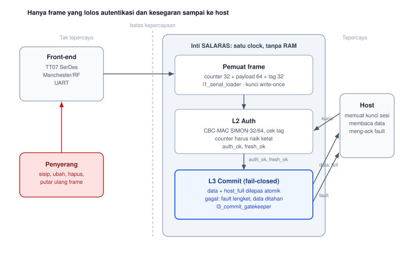

# SALARAS — Authenticated Fail-Closed Ingress Boundary

**PERURI Chip Hackathon 2026 · Area 04 Secure Communication**
Tim *dinotice* · Universitas Telkom

[](https://github.com/bokumentation/hackathon-2026-01/actions/workflows/link.yaml)
[](https://github.com/bokumentation/hackathon-2026-01/actions/workflows/lint.yaml)
[](https://github.com/bokumentation/hackathon-2026-01/actions/workflows/synth.yaml)
[](https://github.com/bokumentation/hackathon-2026-01/actions/workflows/test.yaml)
[](https://github.com/bokumentation/hackathon-2026-01/actions/workflows/formal.yaml)
[](https://github.com/bokumentation/hackathon-2026-01/actions/workflows/sim.yaml)
[](https://github.com/bokumentation/hackathon-2026-01/actions/workflows/docs.yaml)
[](LICENSE)

---

## What this is

A small, reusable hardware IP block that closes the gap between receiving a serial/RF frame and trusting it.

The problem is measured on a real baseline: the Tiny Tapeout 07 Manchester decoder `tt07-bep-decode` receives a 24-bit integrity field and never checks it, so a corrupt or fault-injected frame still appears valid to the host (CWE-354). The integrity field itself is an undocumented error-correcting code — unsolved.

SALARAS fixes this with three composable layers:

| Layer | Module | What it does | CWE closed |
| --- | --- | --- | --- |
| **L1 serial loader** | `l1_serial_loader.v` | Shift in 64-bit key then 128-bit frame (counter + payload + tag) over a single-bit interface; key-lock prevents second key load | CWE-20 |
| **L2 auth** | `l2_auth.v` | SIMON-32/64 CBC-MAC over `counter + payload`, compare 32-bit tag; counter freshness check | CWE-354, CWE-345, CWE-294 |
| **L3 commit** | `l3_commit_gatekeeper.v` | Atomic fail-closed commit; sticky fault on any auth or freshness failure | CWE-1264, CWE-1245 |

```
untrusted link
      │  frame_bit, load_en, key_mode
      ▼
┌─────────────────────────────────┐
│  L1  l1_serial_loader           │  key-load / frame shift-in FSM
│      key_locked after 64 bits   │  CWE-20
└────────────┬────────────────────┘
             │  counter(32) + payload(64) + tag(32) + start
             ▼
┌─────────────────────────────────┐
│  L2  l2_auth                    │  SIMON-32/64 CBC-MAC (3 blocks)
│      simon32_64 inside          │  + counter freshness check
│      auth_ok, fresh_ok          │  CWE-354, CWE-345, CWE-294
└────────────┬────────────────────┘
             │  auth_ok & fresh_ok (on frame_done)
             ▼
┌─────────────────────────────────┐
│  L3  l3_commit_gatekeeper       │  atomic fail-closed commit
│      pass → host_full + data    │  sticky fault on failure
│      fail → fault (sticky)      │  CWE-1264, CWE-1245
└────────────┬────────────────────┘
             │  host_full, host_data (only on pass)
             ▼
           host
```




---

## Results

| Metric | Value | Reproduced by |
| --- | --- | --- |
| Single-bit flip rejection | 128/128 | `make l2` |
| False reject rate | 0% (20/20 clean frames) | `make l2` |
| End-to-end latency | 108 cycles @ 50 MHz = 2.16 µs | `make auth` |
| Commit latency | 1 cycle | `make auth` |
| Forgery rejected | yes | `make l2`, `make auth` |
| Replay rejected | yes | `make auth` |
| Formal properties | 5 blocking + 1 non-blocking + 6 L1 | `make formal` |
| ASIC die area | 0.0756 mm² (2×2 tile, sky130) | `gds.yaml` |
| ASIC cell count | 2354 cells | `gds.yaml` |
| ASIC power | 1.87 mW typical | `gds.yaml` |
| DRC violations | 0 | `gds.yaml` |
| LVS violations | 0 | `gds.yaml` |

Full evidence: [`sim/RESULTS.md`](sim/RESULTS.md) · [`synth/area.md`](synth/area.md)

---

## Scope

| Tier | Status | Description |
| --- | --- | --- |
| **Tier A** | ✅ Committed | Authenticated, replay-resistant, fail-closed boundary. Single clock. Simulation evidence, formal proofs, sky130 2×2 signoff. |
| **Tier B** | Planned | Attach the boundary to a serial link (`TT_UM_SERDES`, 8b/10b framing). |
| **Tier C** | Future | Clock-domain crossing using `tt07_cdc_fifo`. |
| **Appendix RF** | Archived | Manchester/RF predecessor kept as problem evidence in `appendix/rf/`. |

---

## Repository layout

```
.
├── src/                  Committed RTL (l1_serial_loader, simon32_64, l2_auth, l3_commit, top, project)
├── test/                 cocotb suites + Windows run_*.py scripts
├── synth/
│   ├── formal/           SymbiYosys properties (.sby + .sv)
│   └── area.md           Yosys estimates and sky130 signoff numbers
├── sim/                  RF appendix simulation evidence and RESULTS.md
├── fpga/de10nano/        Link DE10-Nano project (Quartus)
├── appendix/rf/          Archived Manchester/RF design (problem evidence)
├── baseline/             Pinned Tiny Tapeout 07 submodules
├── docs/
│   ├── proposal/         Competition proposal (ID + EN) and PDF build
│   ├── design/           Architecture, threat model, trade study, FMEA, Quartus plan/report, SignalTap
│   ├── setup/            Host setup and repository workflow (Debian 13)
│   ├── judging/          Submission audit, judge QnA, feasibility, prior-art analysis
│   ├── competition/      PERURI Chip Hackathon handbook and rules
│   ├── references/       Third-party papers (Markdown; original PDFs not tracked)
│   ├── datasheet/        Board and device datasheet notes
│   ├── submission/       Submission checklist and deliverables
│   └── deck/             Presentation deck sources (builds into output/)
├── assets/               SVG figures referenced in README and proposal
├── output/               Generated PDF export (not committed)
├── gds/                  Generated ASIC output (not committed; see gds.yaml)
├── openlane/             OpenLane entry configuration
├── tools/                Integrity-field analysis scripts
├── .github/workflows/    CI: lint, synth, test, formal, sim, gds, docs
├── info.yaml             Tiny Tapeout project metadata
├── Makefile              Build entry point (`make help` to list all targets)
└── requirements.txt      Python verification dependencies
```

---

## Quick start

### Prerequisites

- Python 3.11+
- Icarus Verilog (`iverilog`)
- Verilator (RTL lint)
- Yosys (synthesis check)
- SymbiYosys / OSS CAD Suite (formal, optional)
- Intel Quartus Prime Lite (DE10-Nano FPGA, optional)

### 1. Clone

```bash
git clone --recurse-submodules git@github.com:bokumentation/hackathon-2026-01.git
cd hackathon-2026-01
```

If you cloned without `--recurse-submodules`:

```bash
git submodule update --init --recursive
```

### 2. Set up the environment

```bash
python3 -m venv venv
source venv/bin/activate        # Windows: venv\Scripts\activate
pip install -r requirements.txt
```

Or: `make env && source venv/bin/activate`

### 3. Run the verification stack

```bash
make lint          # RTL lint with Verilator
make synth-check   # Synthesizability check with Yosys
make simon         # SIMON-32/64 cipher tests (2 tests, 49 vectors)
make l2            # L2 auth + freshness tests (4 tests, 128 bit-flip checks)
make auth          # Integrated auth + commit tests (6 tests, 108-cycle latency)
make wrapper       # Tiny Tapeout wrapper tests (5 tests)
make formal        # SymbiYosys formal properties (5 blocking + 1 non-blocking)
```

On **Windows** (no `make`):

```bash
python test/run_simon_test.py
python test/run_l2_test.py
python test/run_auth_test.py
python test/run_project_test.py
```

### 4. Full target reference

| Command | Description |
| --- | --- |
| `make help` | List all available targets |
| `make env` | Create the Python virtual environment |
| `make submodules` | Initialize and update baseline submodules |
| `make lint` | RTL lint with Verilator |
| `make synth-check` | Synthesizability check with Yosys |
| `make area` | Cell, FF, and Cyclone V resource estimates |
| `make simon` | SIMON-32/64 cipher and CBC-MAC tests |
| `make l2` | L2 authentication and freshness tests |
| `make auth` | Integrated authentication and commit tests |
| `make wrapper` | Tiny Tapeout wrapper tests |
| `make formal` | SymbiYosys formal properties |
| `make sim` | RF appendix simulation evidence |
| `make gds` | Instructions for ASIC hardening |
| `make fpga` | Instructions for DE10-Nano build |
| `make clean` | Remove build artifacts |

---

## ASIC hardening

Hardening runs through the official Tiny Tapeout GDS GitHub Action
[`.github/workflows/gds.yaml`](.github/workflows/gds.yaml).
Trigger it with a workflow dispatch or push a `v*` tag.

Configuration: [`src/config.tcl`](src/config.tcl), [`src/user_config.tcl`](src/user_config.tcl), [`info.yaml`](info.yaml).

The last passing run: 2×2 tile, 2354 cells, 0 DRC, 0 LVS, WNS +10.79 ns, 1.87 mW typical.

## FPGA build

DE10-Nano flow: [`fpga/de10nano/README.md`](fpga/de10nano/README.md).

Key-load / frame-load protocol uses `SW[0]`: set high to shift the 64-bit key MSB-first; `LEDR[5]` lights when the key is locked. Set `SW[0]` low and shift the 128-bit frame (counter + payload + tag).

## Proposal

- Indonesian: [`docs/proposal/proposal-salaras.id.md`](docs/proposal/proposal-salaras.id.md)
- English: [`docs/proposal/proposal-salaras.en.md`](docs/proposal/proposal-salaras.en.md)

Build the proposal HTML and PDF from the repository root:

```bash
make docs
```

To build every documentation set (proposal, deck, judging, ideas):

```bash
make docs-all
```

---

## Security

Two Tier A vulnerabilities were identified and fixed on this branch:

| ID | CWE | Description | Fix |
| --- | --- | --- | --- |
| Bug 1 | CWE-1264 | TOCTOU: `salaras_auth_top` passed live input ports to L3 instead of the latched values from L2. Committed data could differ from authenticated data. | `l2_auth` now exposes `counter_q` / `payload_q` latched outputs; `salaras_auth_top` passes these to L3. |
| Bug 2 | — | Key-path separation: `project.v` and the DE10-Nano wrapper loaded the key from the same 192-bit shift register as the frame. | Separate 64-bit `key_sr` with `key_mode` pin (`SW[0]`) and `key_locked` flag. |

See [`SECURITY.md`](SECURITY.md) for the responsible-disclosure policy.

---

## Baselines

| Submodule | Upstream | Role |
| --- | --- | --- |
| `baseline/tt07-bep-decode` | [DusterTheFirst/tt07-bep-decode](https://github.com/DusterTheFirst/tt07-bep-decode) | Manchester/RF problem evidence (CWE-354) |
| `baseline/TT_UM_SERDES` | [Santeep/TT_UM_SERDES](https://github.com/Santeep/TT_UM_SERDES) | Serial link reference (Tier B) |
| `baseline/tt07_cdc_fifo` | [Pa1mantri/tt07_cdc_fifo](https://github.com/Pa1mantri/tt07_cdc_fifo) | Clock-domain crossing (Tier C) |

All three are Apache-2.0. See [`NOTICE`](NOTICE) for attribution.

---

## Contributing

See [`CONTRIBUTING.md`](CONTRIBUTING.md).
Run `make lint` and `make synth-check` before opening a pull request.

## License

Apache-2.0. See [`LICENSE`](LICENSE) and [`NOTICE`](NOTICE).
