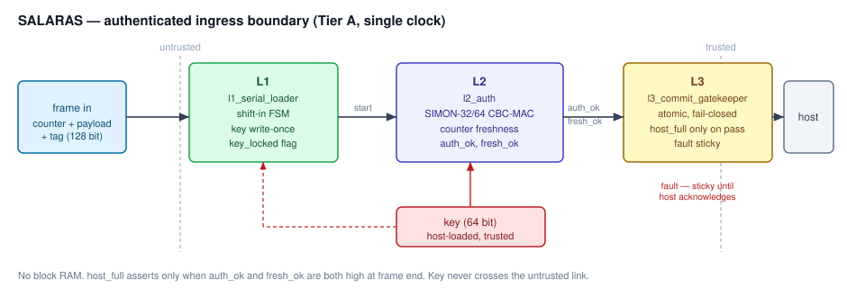

# A Reusable, Fail-Closed Authenticated Ingress Boundary for Serial/RF Links

[](https://github.com/bokumentation/hackathon-2026-01/actions/workflows/link.yaml)
[](https://github.com/bokumentation/hackathon-2026-01/actions/workflows/lint.yaml)
[](https://github.com/bokumentation/hackathon-2026-01/actions/workflows/synth.yaml)
[](https://github.com/bokumentation/hackathon-2026-01/actions/workflows/test.yaml)
[](https://github.com/bokumentation/hackathon-2026-01/actions/workflows/formal.yaml)
[](https://github.com/bokumentation/hackathon-2026-01/actions/workflows/sim.yaml)
[](https://github.com/bokumentation/hackathon-2026-01/actions/workflows/docs.yaml)
[](LICENSE)

## Overview

This repository is the committed design for the PERURI Chip Hackathon 2026,
Area 04 Secure Communication.

The problem is measured on a real baseline: the Tiny Tapeout 07 Manchester
decoder `tt07-bep-decode` receives a 24-bit integrity field and never checks it,
so a corrupt or fault-injected frame still appears valid to the host (CWE-354).
The field itself is an undocumented error-correcting code and is unsolved.

The committed design, the authenticated ingress boundary, closes that gap:

- **L2 auth**: SIMON-32/64 in fixed-length CBC-MAC mode over `counter + payload`,
  plus a counter freshness check (CWE-354, CWE-345, CWE-294).
- **L3 commit**: atomic fail-closed commit of data and control, with a sticky
  fault until acknowledged (CWE-1264).

```
frame (counter + payload + tag)
        |
   L2 auth  (SIMON-32/64 CBC-MAC + counter freshness)
        |
   L3 commit  (fail-closed, sticky fault)
        |
   host  (host_full, host_data, fault)
```




The Manchester/RF predecessor is archived under `appendix/rf/` as the CWE-354
problem evidence and is not the committed design.

## Status and scope

- **Committed (Tier A):** the authenticated, replay-resistant, fail-closed boundary, single clock, with simulation evidence, formal proofs, and a real sky130 2x2 signoff.
- **Next (Tier B):** attach the boundary to a serial link on `TT_UM_SERDES` (8b/10b framing, word lock, control symbols).
- **Future (Tier C):** a clock-domain crossing with the vendored `tt07_cdc_fifo`.
- **Problem evidence (appendix):** the Manchester/RF baseline accepts corrupt frames; its integrity field is an unsolved error-correcting code, so no RF detection rate is claimed.

## How to use this repository

### Prerequisites

- `git`
- Python 3.11 or newer
- Verilator (RTL lint)
- Yosys (synthesizability check)
- SymbiYosys or the OSS CAD Suite (formal properties)
- Icarus Verilog or Verilator with cocotb (simulation)
- Quartus Prime Lite (optional, for the DE10-Nano FPGA build)

### Clone

```bash
git clone --recurse-submodules git@github.com:bokumentation/hackathon-2026-01.git
cd hackathon-2026-01
```

If you cloned without submodules, or the baseline directories are empty:

```bash
git submodule update --init --recursive
```

### Environment

```bash
python3 -m venv venv
source venv/bin/activate
pip install -r requirements.txt
```

Or run `make env`, which does the same.

### Common tasks

| Command | What it does |
| --- | --- |
| `make help` | List every target |
| `make submodules` | Initialize and update the baseline submodules |
| `make env` | Create the Python virtual environment |
| `make lint` | Lint the committed RTL with Verilator |
| `make synth-check` | Check synthesizability with Yosys |
| `make area` | Estimate cell, FF, and Cyclone V resource usage |
| `make formal` | Run the SymbiYosys formal properties |
| `make simon` | SIMON-32/64 block and CBC-MAC tests |
| `make l2` | L2 authentication and freshness tests |
| `make auth` | Integrated authentication and commit tests |
| `make crc` | RF CRC streaming latency (comparison) |
| `make test` | RF appendix unit cocotb suite |
| `make sim` | RF appendix simulation evidence suites |
| `make gds` | Instructions for ASIC hardening |
| `make fpga` | Instructions for the DE10-Nano build |
| `make clean` | Remove build outputs |

A typical first run:

```bash
make lint
make synth-check
make simon
make l2
make auth
```

### ASIC hardening

ASIC hardening runs through the official Tiny Tapeout GDS GitHub Action in
[`.github/workflows/gds.yaml`](.github/workflows/gds.yaml).
Trigger it with a workflow dispatch or a `v*` tag.
The configuration lives in [`src/config.tcl`](src/config.tcl),
[`src/user_config.tcl`](src/user_config.tcl), and [`info.yaml`](info.yaml).

### FPGA build

The DE10-Nano flow is documented in [`fpga/de10nano/README.md`](fpga/de10nano/README.md).

### Documentation

The proposal and supporting documents are in [`docs/`](docs/).
Build the proposal and deck PDFs with:

```bash
bash docs/proposal/build.sh
bash docs/deck/build.sh
```

The proposal source is [`docs/proposal/salaras-rx-proposal.id.md`](docs/proposal/salaras-rx-proposal.id.md) (Indonesian) and [`docs/proposal/salaras-rx-proposal.en.md`](docs/proposal/salaras-rx-proposal.en.md) (English).

## Tutorial: Running the full verification flow

This tutorial walks through every verification step from a clean clone to a
passing formal proof. Each step shows the exact command and a one-line summary
of what a successful run produces.

### Step 1 - Clone and set up the environment

```bash
git clone --recurse-submodules git@github.com:bokumentation/hackathon-2026-01.git
cd hackathon-2026-01
make env
source venv/bin/activate
```

Expected: the virtual environment is created and all Python dependencies from
`requirements.txt` are installed with no errors.

### Step 2 - RTL lint

```bash
make lint
```

Expected: Verilator exits with no warnings or errors on the committed RTL under
`src/`. The final line is `Lint OK`.

### Step 3 - Synthesis check

```bash
make synth-check
```

Expected: Yosys synthesizes `tt_um_bokumentation_auth_boundary` without
undefined modules or unresolved references. The final line is `End of script.`
with no fatal errors.

### Step 4 - SIMON cipher tests

```bash
make simon
```

Expected: 2 tests pass covering 49 vectors (1 published SIMON-32/64 vector plus
48 random vectors) and a 3-block CBC-MAC check. Output ends with
`2 passed, 0 failed`.

### Step 5 - L2 authentication tests

```bash
make l2
```

Expected: 4 tests pass. The suite exercises 20 clean frames (all accepted), a
forgery, a wrong-key attempt, a replay, a stale counter, and 128 single-bit
flips (32 counter bits, 64 payload bits, 32 tag bits). Every flip is rejected.
Output ends with `4 passed, 0 failed`.

### Step 6 - Integrated authentication tests

```bash
make auth
```

Expected: 6 tests pass covering clean commit (`host_full=1, fault=0`), forgery
(`fault=1`), replay (`fault=1`), and sticky-fault hold. End-to-end latency
measured at 108 cycles (107 for MAC plus freshness, 1 for commit). Output ends
with `6 passed, 0 failed`.

### Step 7 - Tiny Tapeout wrapper tests

```bash
make wrapper
```

Expected: 5 tests pass exercising the `tt_um_bokumentation_auth_boundary`
wrapper pins: reset, a clean commit through the full pin interface, a forgery
rejection, a replay rejection, and a sticky-fault clear. Output ends with
`5 passed, 0 failed`.

### Step 8 - Formal verification

```bash
make formal
```

Note: requires SymbiYosys from the OSS CAD Suite. Install with
`pip install oss-cad-suite` or download the nightly from
<https://github.com/YosysHQ/oss-cad-suite-build/releases>.

Expected: 5 properties pass with bounded model checking to depth 20. The
properties cover fail-closed guarantee, sticky fault, fault-ack clear, counter
monotonicity, and no phantom accepts. Output ends with `5 passed`.

### Step 9 - ASIC hardening

ASIC hardening is not run locally. Trigger the
[`gds.yaml`](.github/workflows/gds.yaml) workflow on GitHub Actions with a
workflow dispatch event or push a `v*` tag. The action runs OpenLane on the
Tiny Tapeout infrastructure and uploads GDS, LEF, and signoff reports as
artifacts. The last passing run produced a 2x2 tile with 2354 cells, 0 DRC
violations, and 1.87 mW typical power (see Results below).

## Repository layout

```
.
├── .editorconfig            Editor and line-ending defaults
├── .gitattributes           Text/binary and linguist rules
├── .github/                 CI workflows, PR and issue templates
├── AGENTS.md                Project rules
├── CHANGELOG.md             Release history
├── CONTRIBUTING.md          Contribution guide
├── LICENSE                  Apache-2.0
├── NOTICE                   Third-party attribution
├── SECURITY.md              Security policy
├── appendix/rf/             Archived Manchester/RF design
│   ├── fpga/de10nano/       RF DE10-Nano project
│   ├── replay/              ESP32 Manchester replay
│   └── src/                 RF RTL
├── assets/                  README figures
├── baseline/                Pinned Tiny Tapeout 07 submodules
├── docs/                    Proposal, design, deck, judging, competition
├── fpga/de10nano/           Link DE10-Nano project
├── gds/                     Generated ASIC output (not committed)
├── openlane/                OpenLane entry configuration
├── sim/                     RF simulation evidence harness and results
├── src/                     Committed link RTL
├── synth/                   Yosys, SymbiYosys, and the area report
├── test/                    cocotb suites
├── tools/                   Integrity-field analysis scripts
├── info.yaml                Tiny Tapeout project metadata
├── Makefile                 Build entry point
├── opencode.json            opencode configuration
└── requirements.txt         Python verification dependencies
```

## Results

| Metric | Value | How to reproduce |
| --- | --- | --- |
| Bit-flip rejection | 128/128 | `make l2` |
| False reject rate | 0% (20/20 clean frames) | `make l2` |
| End-to-end latency | 108 cycles at 50 MHz = 2.16 us | `make auth` |
| Commit latency | 1 cycle | `make auth` |
| Forgery rejected | yes | `make l2`, `make auth` |
| Replay rejected | yes | `make auth` |
| Formal properties | 5 pass | `make formal` |
| ASIC die area | 0.0756 mm2 (2x2 tile) | gds.yaml |
| ASIC power | 1.87 mW typical | gds.yaml |
| DRC violations | 0 | gds.yaml |

Full detail is in [`sim/RESULTS.md`](sim/RESULTS.md) and
[`synth/area.md`](synth/area.md).

## Security

Two vulnerabilities have been fixed on the Security branch: CWE-1264 (TOCTOU
between authentication and commit) and key-path separation (preventing key
material from flowing to the data output path).

See [`SECURITY.md`](SECURITY.md) for the responsible-disclosure policy and
contact details.

The fixes are on the
[`security`](https://github.com/bokumentation/hackathon-2026-01/tree/security)
branch.

## Baselines

| Submodule | Upstream | Role |
| --- | --- | --- |
| `baseline/tt07-bep-decode` | [DusterTheFirst/tt07-bep-decode](https://github.com/DusterTheFirst/tt07-bep-decode) | Manchester/RF problem evidence |
| `baseline/TT_UM_SERDES` | [Santeep/TT_UM_SERDES](https://github.com/Santeep/TT_UM_SERDES) | Serial link reference (next stage) |
| `baseline/tt07_cdc_fifo` | [Pa1mantri/tt07_cdc_fifo](https://github.com/Pa1mantri/tt07_cdc_fifo) | Clock domain crossing (next stage) |

All three are Apache-2.0. See [`NOTICE`](NOTICE) for attribution.

## Targets

- **ASIC:** Tiny Tapeout sky130 130nm via OpenLane.
- **FPGA:** Terasic DE10-Nano, Intel Cyclone V SoC.

## Contributing

See [`CONTRIBUTING.md`](CONTRIBUTING.md).
Run `make lint` and `make synth-check` before opening a pull request.

## License

Apache-2.0. See [`LICENSE`](LICENSE) and [`NOTICE`](NOTICE).
