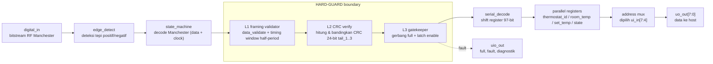

# PROPOSAL PESERTA HACKATHON CHIP 2026

Kategori: IC Chip Design & FPGA Implementation

## Identitas Tim

Judul Ide Desain Chip: HARD-GUARD - Hardened Interface Integrity Boundary untuk Jalur Data RF Manchester Decoder

Nama Tim: [isi nama tim]

Anggota Tim (2-4 orang):

- Ketua: [Nama Ketua] - [Institusi/Universitas] - [Email/HP]
- Anggota 1: [Nama Anggota] - [Institusi/Universitas] - [Email/HP]
- Anggota 2: [Nama Anggota] - [Institusi/Universitas] - [Email/HP]

Dosen Pembimbing: [Nama Dosen & Gelar] - [Institusi]

## 1. Ringkasan Ide (Executive Summary)

Masalah yang Diangkat:

Sistem identitas aman seperti e-KTP (ISO/IEC 7816) melindungi data di lapisan aplikasi melalui secure messaging dan mutual authentication.
Namun lapisan fisik dan transport frame sering terlewat: banyak decoder RF menerima frame, mengambil payload, tetapi tidak pernah memverifikasi field integritas (CRC) yang sebenarnya sudah dikirim bersama frame.
Pada baseline 433MHz Manchester decoder Tiny Tapeout 07, field CRC 24-bit (tail_1..3) diambil dan diekspos ke host, tetapi tidak pernah dicek.
Akibatnya payload yang korup atau termanipulasi tetap tampil valid bagi host.
Praktik ini termasuk kelas kelemahan CWE-325 (Missing Cryptographic Step) dan menjadi bagian dari threat model physical access (T.Mem-Access) pada evaluasi Common Criteria.

Solusi yang Ditawarkan:

HARD-GUARD adalah boundary verifikasi integritas berbasis hardware yang dipasang pada jalur data antara decoder Manchester dan register paralel host.
Boundary ini terdiri dari tiga tahap:

1. Layer 1 (Framing Validator): memperluas blok validasi yang sudah ada (data_validate) dengan pemeriksaan waktu pada half-period Manchester untuk menolak tepi yang tidak sesuai laju.
2. Layer 2 (Integrity Verify): memverifikasi CRC 24-bit yang sudah ada pada frame (tail_1..3) yang selama ini tidak pernah dicek.
3. Layer 3 (Gatekeeper): mengendalikan sinyal handshake full dan latch enable register. Jika verifikasi gagal, boundary menahan full tetap rendah dan menaikkan fault flag khusus ke host.

Chip yang Dirancang:

IP block digital murni berukuran kecil (target tetap dekat 1 tile Tiny Tapeout) yang dapat disisipkan pada jalur ingress decoder RF mana pun, tanpa mengubah format frame dan tanpa menambah buffer besar.

Target Pengguna:

- Perancang secure element dan smart card contactless yang menerima frame dari front-end RF (mis. sistem identitas, akses kontrol, pembayaran contactless).
- Tim firmware yang memakai MCU/HPS sebagai host dan membutuhkan jaminan bahwa frame yang dibaca sudah lolos verifikasi integritas.
- Integrator IP yang memerlukan blok ingress-hardening siap pakai.

Dampak:

Mengurangi risiko integritas data pada jalur fisik: frame korup atau hasil fault injection tidak lagi terlihat valid oleh host.
Memberi jaminan verifikasi yang terukur (detection rate, false-reject rate, latency) alih-alih mengandalkan verifikasi di software setelah data masuk memori.

## 2. Latar Belakang & Rumusan Masalah (Problem Statement)

Latar Belakang:

Perancangan chip dan IP block untuk keamanan penting karena banyak sistem memercayai data yang telah di-decode dan dianggap valid begitu saja.
Pada rantai pemrosesan RF (mis. remote control dan smart card contactless), decoder mengonversi sinyal Manchester menjadi bit, menyusun frame, dan mengekspos field-fieldnya ke host.
Verifikasi yang ada umumnya berhenti di awal frame (preamble, type, constant) dan tidak memeriksa integritas payload beserta CRC di akhir frame.

Gap terhadap Solusi yang Tersedia:

- Solusi software/firmware: verifikasi CRC dilakukan setelah data masuk ke memori host, sehingga data korup sempat melewati batas kepercayaan.
- Solusi decoder standar (termasuk baseline): memvalidasi awal frame saja; CRC diambil tetapi diabaikan.
- Solusi checksum tambahan: menambah field integritas baru berarti mengubah format frame dan menambah kompleksitas yang tidak kompatibel dengan perangkat yang sudah ada.
HARD-GUARD menutup gap ini dengan memverifikasi field integritas yang sudah ada, tepat pada boundary handshake, tanpa mengubah protokol.

Rumusan Masalah & Perancangan:

Bagaimana merancang boundary hardware kecil dan hemat area yang memverifikasi integritas frame pada jalur data decoder-manchester ke register host, sehingga frame yang gagal verifikasi tidak pernah sampai ke host, dengan overhead latency dan area yang terukur?
Batasan desain: hemat area (target tetap dekat 1 tile Tiny Tapeout), tidak menambah FIFO besar, dan tetap kompatibel dengan baseline tanpa mengubah format frame.

## 3. Proposed Chip Design

### 3.1 Arsitektur Chip & Fungsi Utama

Arsitektur chip adalah jalur digital tersinkronisasi satu clock (clock domain tunggal) yang terdiri dari tiga blok fungsional:

- Decoder front-end: edge_detect dan state_machine yang mengubah bitstream RF Manchester menjadi data + clock.
- HARD-GUARD boundary: L1 framing validator, L2 integrity verify (CRC), L3 gatekeeper.
- Register dan interface host: shift register 97-bit, register data, address mux, dan jalur uo_out/uio_out.

Fungsi utama: menerima bitstream RF, memvalidasi framing dan integritas, lalu menyajikan hanya frame yang valid ke host melalui handshake full, sambil memberi sinyal fault bila verifikasi gagal.

Input/Output:

| Sinyal | Arah | Lebar | Fungsi |
| --- | --- | --- | --- |
| digital_in (ui_in[0]) | Input | 1 | bitstream RF Manchester |
| halt (ui_in[2]) | Input | 1 | menahan update register saat host membaca |
| address (ui_in[7:4]) | Input | 4 | pemilih register output |
| clk | Input | 1 | clock sistem |
| rst_n | Input | 1 | reset aktif rendah |
| uo_out[7:0] | Output | 8 | data register terpilih (gated oleh halt) |
| full (uio[0]) | Output | 1 | frame lengkap dan valid |
| fault (uio yang dialokasikan) | Output | 1 | flag kegagalan verifikasi (sinyal baru) |
| uio lain | Output | - | manchester_clock, manchester_data, transmission_begin, pos_edge, neg_edge |

Arsitektur Pemrosesan:

- Aliran data satu arah (streaming) dengan opsi operasi single-cycle per bit.
- L1 berjalan bersamaan dengan decoding framing; L2 menghitung CRC secara pipelined (LFSR) sambil bit payload masuk, lalu membandingkan saat tail_1..3 lengkap; L3 bersifat kombinasional untuk gerbang dan berupa latch untuk fault flag.
- Tidak ada loop pemrosesan berulang; kompleksitas O(n) terhadap jumlah bit frame.

Arsitektur Memori:

- Tidak memerlukan block RAM: payload disimpan pada shift register 97-bit yang sudah ada.
- State tambahan hanya berupa register kecil (LFSR CRC, flag, counter timing).
- Tidak ada akses memori eksternal; seluruh state ada di flip-flop.

Interface & Komunikasi:

- Interface ke host: bus data 8-bit (uo_out) dengan address 4-bit, sinkronisasi memakai sinyal full sebagai handshake dan fault sebagai notifikasi error. Sinyal fault dapat dipetakan ke interrupt HPS pada DE10-Nano.
- Interface ke front-end RF: satu pin input digital.
- Protokol eksternal yang dipertahankan: frame Manchester 96-bit (preamble/type/constant) + 96-bit data + CRC 24-bit.

Konsumsi Daya:

- Konsumsi daya rendah karena seluruhnya logika digital dan clock tunggal; tidak ada DSP, PLL internal, atau memori besar.
- LFSR CRC dan pembanding aktif hanya saat frame datang, sehingga aktivitas switching minimal saat idle. Estimasi daya diisi setelah sintesis (power analysis Quartus).

Pendekatan RTL:

- Verilog, gaya RTL tersintesiskan penuh (tanpa primitif vendor), clock tunggal, reset sinkron/asinkron yang konsisten.
- Boundary didesain sebagai modul terpisah (hard_guard_l1/l2/l3) yang dapat diaktifkan/dimatikan lewat parameter agar kompatibel penuh dengan baseline.

ISA:

- Tidak relevan: ini desain hardwired tanpa instruksi. Kontrol dilakukan melalui register dan sinyal handshake, bukan instruksi program.

IP yang Digunakan:

- Tidak menggunakan IP komersial. Seluruh kode memakai sumber terbuka yang tersedia di baseline dan pustaka standar (referensi GitHub pada Bagian 4).

Target FPGA/ASIC & Technology Node:

- Target FPGA: Intel Cyclone V SoC (DE10-Nano), 110.000 LE, 1.100 Kbit M10K, 112 DSP.
- Target ASIC: Tiny Tapeout 07 flow, PDK open-source SkyWater sky130 (technology node 130nm) melalui OpenLane, ukuran 1 tile.
- HARD-GUARD dirancang agar satu RTL sumber dapat dipakai untuk FPGA maupun ASIC.

Diagram Blok Sistem:

[ Rincian Modul RTL ]

- L1 framing validator: reuse dan perluas data_validate. Pemeriksaan tambahan berupa jendela waktu (timing window) di sekitar half-period 9 tick yang sudah ada di state_machine.
- L2 integrity verify: modul CRC (LFSR) yang menghitung CRC dari byte payload dan membandingkannya dengan tail_1..3 yang diterima. Polinomial dan seed akan dikonfirmasi dari hasil reverse-engineering data uji.
- L3 gatekeeper: logika kombinasional/sekunsial yang menahan full dan latch enable saat verifikasi gagal, serta menyetel fault flag.

[ Estimasi Penggunaan Resource FPGA ]

| Komponen Resource | Estimasi Penggunaan | Kapasitas DE10-Nano |
| --- | --- | --- |
| Logic Elements / LUT | [isi setelah sintesis] | 110,000 LEs / 41,910 ALMs |
| Registers / Flip-Flops (FF) | [isi setelah sintesis] | 415,000 |
| Block RAM (M10K) | 0 (tidak ada buffer) | 5,570 Kbits |
| DSP Blocks | 0 (CRC berbasis LFSR) | 112 DSP |

Catatan: angka estimasi diisi dari laporan fitter Quartus Prime setelah sintesis RTL.

Perangkat Lunak & Tools Perancangan:

- Intel Quartus Prime (sintesis, fit, timing, SignalTap)
- OpenLane + Yosys (jalur ASIC sky130)
- Verilator / Icarus Verilog (simulasi RTL dan lint)
- cocotb + pytest (testbench otomatis berbasis Python)
- Python (numerik untuk reverse-engineering CRC dan fault injection)

### 3.2 Strategi Verifikasi & Simulasi

Strategi Simulasi:

Testbench otomatis dibangun di atas kerangka cocotb yang sudah ada pada baseline, memakai data rekaman RF nyata.
Skenario:
- Uji fungsionalitas pada frame bersih (harus lolos tanpa regresi).
- Uji corner-case: frame dengan start termutilasi, stream sangat panjang, dan capture noise (harus tetap menolak dengan benar).
- Fault injection: penyuntikan single-bit flip pada byte payload dan pada byte CRC, plus gangguan timing/jitter, untuk mengukur detection rate.

Strategi Verifikasi:

- Self-checking testbench dengan assertion (bukan sekadar inspeksi waveform).
- Uji kesetaraan: frame bersih menghasilkan output identik dengan baseline (tidak ada regresi).
- Lint dan cek sintesis (Verilator lint, Yosys) sebelum implementasi.
- Traceability: setiap klaim metrik dipetakan ke satu test case.

Pengujian Design Chip:

- Simulasi RTL level (fungsional + fault injection) untuk memastikan arsitektur berjalan sesuai desain.
- Simulasi gate-level (opsional) setelah sintesis untuk cek konsistensi.
- Uji Hardware Board FPGA DE10-Nano: sintesis bitstream di Quartus Prime, unggah ke board, verifikasi sinyal internal dengan SignalTap Logic Analyzer, dan pengujian on-board real-time (frame bersih diterima, frame korup ditolak, fault flag naik).
- Metrik target: detection rate 100% pada set fault injection yang ditentukan; false-reject 0% pada seluruh capture bersih; latency overhead 1-3 siklus clock (dikonfirmasi setelah sintesis); area tetap dekat 1 tile.

## 4. Referensi

- Tiny Tapeout. "Tiny Tapeout." Tautan: https://tinytapeout.com/
- TinyTapeout. "tt07-verilog-template." Tautan: https://github.com/TinyTapeout/tt07-verilog-template
- Kohnen, Z. "tt07-bep-decode: Decoding Manchester coded transmissions in a fully digital ASIC." Tautan: https://github.com/DusterTheFirst/tt07-bep-decode
- Kohnen, Z. dan Alvarado, A. "Manchester decoder of a home thermostat's wireless protocol in the Tiny Tapeout 07 shuttle." Free Silicon Conference (FSiC), 2025.
- The OpenROAD Project. "OpenLane." Tautan: https://github.com/The-OpenROAD-Project/OpenLane
- Google. "SkyWater PDK (sky130)." Tautan: https://github.com/google/skywater-pdk
- cocotb. "cocotb: coroutine based cosimulation library." Tautan: https://github.com/cocotb/cocotb
- MITRE. "CWE-325: Missing Cryptographic Step." Tautan: https://cwe.mitre.org/data/definitions/325.html
- ISO. "ISO/IEC 7816-4: Identification cards - Integrated circuit cards - Part 4." Tautan: https://www.iso.org/standard/54595.html
- Tropic Square. "TROPIC01." Tautan: https://www.tropicsquare.com/tropic01
- Intel. "Cyclone V FPGA." Tautan: https://www.intel.com/content/www/us/en/products/details/fpga/cyclone/cyclone-v.html

## 5. Lampiran

### Identitas Personal Tim

| Nama Anggota | Institusi | Email / HP |
| --- | --- | --- |
| [Nama Ketua] | [Institusi] | [Email/HP] |
| [Nama Anggota 1] | [Institusi] | [Email/HP] |
| [Nama Anggota 2] | [Institusi] | [Email/HP] |

### Pembagian Peran dalam Tim

| Nama Anggota | Keahlian Utama | Tanggung Jawab & Peran |
| --- | --- | --- |
| [Nama Ketua] | RTL / Verilog | RTL Designer: desain L1-L3 dan integrasi baseline |
| [Nama Anggota 1] | Verifikasi / Python | Verification: cocotb, fault injection, metrik |
| [Nama Anggota 2] | FPGA / Embedded | FPGA Integration: Quartus, SignalTap, HPS interaksi |

### Rencana Perubahan saat Bootcamp 3 Hari

| Hari | Fokus Kegiatan | Target Deliverables | Perubahan Rencana |
| --- | --- | --- | --- |
| Hari 1 | Finalisasi RTL HARD-GUARD dan integrasi baseline | RTL L1-L3 dapat disimulasikan | Jika CRC belum diketahui, fokus pada L1 + L3 dahulu |
| Hari 2 | Fault injection dan verifikasi dengan cocotb | Laporan detection rate dan latency | Tambah skenario fault jika waktu memungkinkan |
| Hari 3 | Sintesis Quartus, SignalTap, dan demo DE10-Nano | Bitstream dan demo on-board | Jika timing gagal, turunkan frekuensi clock demo |

### Luaran & Demo (Opsional)

Demo Live: pengujian langsung pada board FPGA DE10-Nano secara real-time: frame bersih diterima, frame korup ditolak, fault flag naik.

Video Demo: video 3-5 menit yang menunjukkan alur kerja.

Repository Source Code: kode RTL (Verilog), testbench cocotb, skrip fault injection, dan bitstream (.sof/.rbf).

Laporan Teknis Singkat: spesifikasi arsitektur, hasil sintesis (resource dan timing), serta analisis performa (detection rate dan latency).