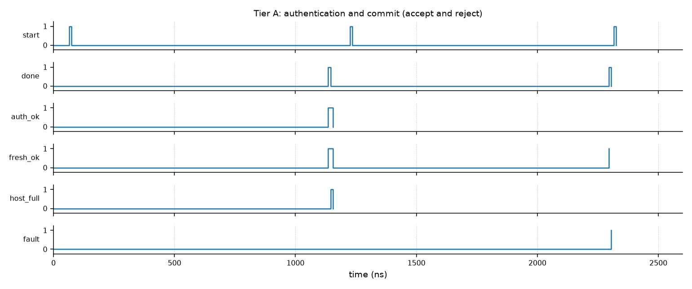

# Lampiran. Hasil Latensi (Simulasi, Tier A)

Dokumen ini menyiapkan lampiran latensi untuk proposal.
Seluruh angka berasal dari simulasi cocotb yang dapat direproduksi dengan `make simon` dan `make sim`.
Nilai yang belum diukur ditandai sebagai estimasi.

## Latensi blok SIMON-32/64

SIMON-32/64 diimplementasikan sebagai blok cipher serial, satu ronde per siklus, dan divalidasi terhadap referensi Python independen pada `test/simon_ref.py`.
Referensi cocok dengan vektor SIMON-32/64 yang dipublikasikan (key `1918111009080100`, plaintext `65656877`, ciphertext `C69BE9BB`).

| Metrik | Nilai |
| --- | --- |
| Vektor blok divalidasi | 49 (1 vektor publik dan 48 acak) |
| Jumlah ronde per blok | 32 |
| Latensi blok (start ke done) | 33 siklus clock |
| CBC-MAC | cocok dengan referensi atas tiga blok |

Latensi 33 siklus sama dengan 32 ronde ditambah satu siklus pipeline.
Angka ini terukur, bukan estimasi.

## Anggaran latensi jalur lengkap (terukur)

| Tahap | Nilai | Status |
| --- | --- | --- |
| Verifikasi MAC ditambah kesegaran (tiga blok) | 107 siklus | terukur |
| Commit atomik L3 | 1 siklus | terukur |
| Latensi ujung ke ujung (start ke `host_full`) | 108 siklus | terukur |
| Visibilitas host | 0 sampai 1 siklus | estimasi |

Latensi Tier A terukur 108 siklus: 107 siklus untuk MAC dan kesegaran, ditambah satu siklus commit.
Angka dalam siklus bersifat primer; konversi ke mikrodetik mengikuti frekuensi clock yang dikonfigurasi.

## Hasil matriks keberhasilan L2 dan L3

| Kasus | Hasil |
| --- | --- |
| Dua puluh frame bersih (counter naik) | semua diterima, false reject 0 |
| Forgery (payload diubah, tag tetap) | ditolak, `fault` naik, `host_full` tetap rendah |
| Kunci salah | ditolak |
| Replay (counter sama) | tidak dikomit, kesegaran gagal |
| Counter basi | kesegaran gagal |
| Counter baru | diterima |
| Single-bit flip (32 counter, 64 payload, 32 tag) | 128 dari 128 ditolak |
| Fault lengket | bertahan sampai `fault_ack` |
| Commit atomik | 1 siklus |
| Dua profil (CRC sintetis dan MAC) | memakai inti commit yang sama, keduanya commit |

<figure class="proto"><figcaption>Gambar: satu frame bersih diterima (auth_ok, fresh_ok, host_full naik) dan satu frame korup ditolak (host_full tetap rendah, fault naik).</figcaption></figure>

## Catatan kejujuran

- Angka 33 siklus per blok, 107 siklus jalur autentikasi, 108 siklus ujung ke ujung, dan 128/128 penolakan bit flip bersifat terukur.
- Profil CRC pada uji dua profil bersifat sintetis dan tidak memvalidasi field RF.
- Tidak ada klaim latensi atau deteksi yang tidak diukur.
