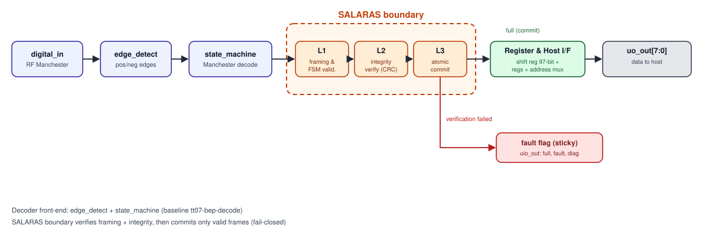
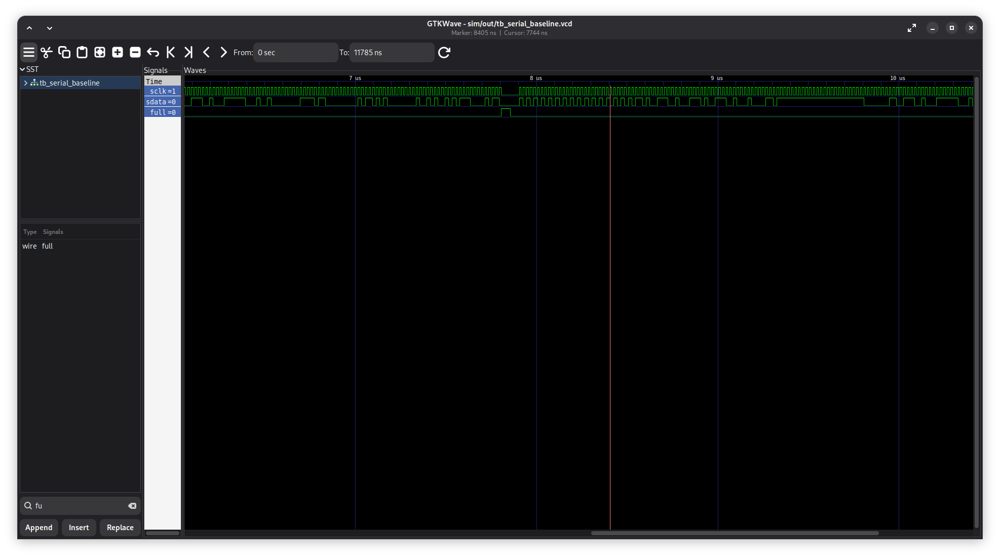
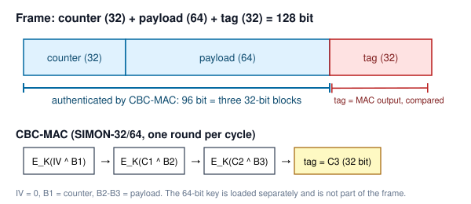
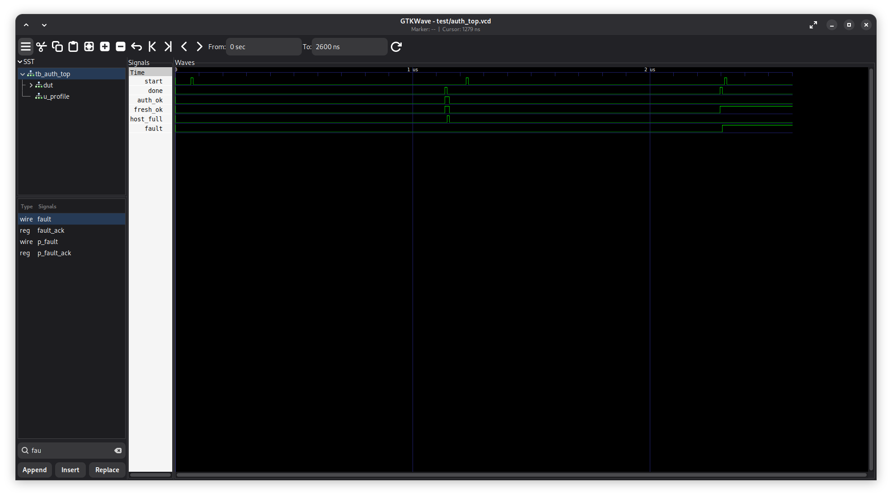

## 1. Ringkasan Ide

**Masalah yang Diangkat:**

Arsitektur dekoder serial mengurai *bitstream* dari sumber tak terpercaya secara langsung ke dalam register, lalu meneruskan _integrity field_ ke host tanpa verifikasi. Pada *baseline* Manchester Tiny Tapeout 07 (tt07-bep-decode), kami mengukur *payload* maupun *integrity field* yang cacat (*corrupted*) tetap diteruskan ke host sebagai frame valid. Tanpa mekanisme kunci dan *counter*, dekoder jenis ini tidak mampu membedakan frame asli dari frame palsu maupun *replay attack* (pemutaran ulang frame lama).

**Solusi yang Ditawarkan:**

Kami mengajukan arsitektur _fail-closed ingress gate_ dengan tiga lapisan pertahanan dalam satu inti (core):

1. **L1 Frame Loader:** Menggeser frame 128-bit (counter + payload + tag) dan kunci 64-bit secara serial, menggunakan mekanisme penguncian _register_ kunci *write-once* yang terkunci hingga sistem di-*reset* (CWE-1224).
2. **L2 Authentication:** Mengimplementasikan CBC-MAC berbasis SIMON-32/64 dengan panjang tetap, dan dilengkapi verifikasi _monotonic counter_ (CWE-345, CWE-354, CWE-294).
3. **L3 Atomic Commit:** Data dan sinyal indikator validasi hanya diaktifkan secara bersamaan (_atomic drive_) dalam satu _clock cycle_ apabila verifikasi autentikasi dan _freshness check_ dinyatakan valid. Jika gagal, indikator _fault_ akan aktif dan berstatus _latched_ (_sticky_) sampai mendapatkan sinyal _acknowledge_ (CWE-1264, CWE-1245).

**Chip yang Dirancang:**

TRI-ARGA merupakan IP digital murni yang bersifat _front-end agnostic_, sehingga fleksibel diintegrasikan di belakang SerDes TT07, dekoder Manchester/RF, maupun UART. 

**Hasil Terukur dalam Simulasi:**

- **Keamanan:** Menolak 100% manipulasi bit (_single-bit flip_ 128/128), _forgery_, kunci salah, dan _replay attack_ tanpa _false reject_ (0/20). Pembuktian formal SymbiYosys mengonfirmasi properti _fail-closed_ terpenuhi.
- **Performa & Latensi:** Verifikasi atomik selesai dalam 108 siklus _clock_ (2,16 µs pada 50 MHz), menghasilkan _throughput_  29 Mbit/s tanpa _bottleneck_.
- **Sintesis ASIC (SkyWater 130nm):** _Core_ L1–L3 hemat area (0,0756 mm²) dengan daya tipikal 2,10 mW (DRC/LVS = 0, WNS = 0,00 ns). Integrasi tautan 8b/10b (Tier B) membutuhkan total daya 3,61 mW.

**Implementasi pada FPGA DE10-Nano:** 

Prototipe dipetakan pada _fabric_ Cyclone V (DE10-Nano) pada frekuensi 50 MHz tanpa menggunakan HPS (_Hard Processor System_). Demonstrasi _on-board_ menerapkan mekanisme _internal loopback_ (`link_tx` ke `link_rx` melintasi _core_ L2+L3), dengan skenario pengujian (_valid_, _corrupt_, atau _replay_) yang dapat diinjeksikan via _DIP switch_. Status validasi dan indikator _fault_ dipantau melalui LED _on-board_ dan _logic analyzer_ SignalTap.

**Dampak & Manfaat:**

- **Keamanan di Tingkat Perangkat Keras (_Hardware-Level Security_):** Eliminasi _overhead_ memastikan host hanya memproses data yang sudah terverifikasi.
- **Efisiensi Silikon:** Kebutuhan area silikon hanya **0,0756 mm²** dan konsumsi daya **2,10 mW** pada ASIC SkyWater 130nm. Saat diintegrasikan dengan modul *serial link* 8b/10b opsional (Tier B), total daya menjadi **3,61 mW**.

**Target Pengguna:**

Perancang secure element dan perangkat identitas, integrator IP yang membutuhkan blok *ingress-hardening*, serta tim software/firmware yang memerlukan jaminan bahwa frame yang dibaca oleh host telah terotentikasi.

## 2. Latar Belakang dan Rumusan Masalah

### 2.1 Latar Belakang
Tautan serial dan RF ringan berperan dalam menyalurkan data antara _transceiver_, terminal, _secure element_, dan _host_ pada ekosistem perangkat identitas seperti e-KTP. Dalam arsitektur keamanan _hardware_, prinsip _fail-closed_ menetapkan bahwa setiap kegagalan proses (akibat kesalahan data, ketidakcocokan kunci, atau indikasi serangan) secara otomatis memicu isolasi jalur data keluar dan memblokir pelepasan data ke _host_. Berbeda dengan pendekatan _fail-open_ yang berisiko meneruskan data cacat saat terjadi gangguan, prinsip _fail-closed_ menjamin sistem selalu kembali ke kondisi menolak akses secara total (_default-deny state_).

Studi kasus modul _baseline_ Manchester 433 MHz `tt07-bep-decode` karya Zachary Kohnen (2024) dianalisis sebagai contoh dari arsitektur dekoder digital penerima. Modul ini mengolah sinyal digital hasil demodulasi dari _front-end_ RF eksternal. Dalam laporannya, Kohnen secara explisit menyatakan bahwa modul ini dirancang dengan memprioritaskan efisiensi area dan penyelesaian sesuai _deadline submission_, sehingga modul validasi keamanan di tingkat _hardware_ belum diimplementasikan. Berikut beberapa temuan kunci:

- **Mekanisme _Pass-Through_ Tanpa Verifikasi:** Modul _baseline_ menerima _integrity field_ 24-bit (`tail_1..3`). Namun, _field_ ini diteruskan secara mentah ke _host_.
- **Kerentanan Validasi Terukur:** Dalam simulasi, _baseline_ meng-*latch* _payload_ maupun _field_ integritas yang korup, lalu secara otomatis meng-*assert* sinyal `full=1` tepat setelah 96 bit diterima tanpa memeriksa keabsahan data.
- **Ketiadaan Proteksi Kriptografis & Replay:** Desain _baseline_ tidak memiliki mekanisme _keyed authentication_ maupun _monotonic counter_, sehingga tidak mampu membedakan _frame_ asli dari _frame_ palsu maupun serangan _replay attack_.

Mitigasi celah keamanan ini melalui _software_ tidaklah memadai, karena pemrosesan berjalan setelah data terlanjur melewati batas kepercayaan (_trust boundary_) _hardware_. Oleh karena itu, diperlukan modul pengaman antarmuka di tingkat silikon sebelum data diserahkan ke _host_.

### 2.2 Analisis *Trade-Off* dan Kesenjangan Arsitektur terhadap Solusi yang Tersedia

Solusi _existing_ di industri umumnya terbagi menjadi beberapa tingkatan (_tier_), namun masing-masing memiliki batasan arsitektural tersendiri untuk aplikasi berdaya rendah:

| **Pendekatan / Arsitektur**           | **Cakupan Proteksi**                                            | **Keterbatasan Arsitektural (Trade-Off)**                                                                       |
| ------------------------------------- | --------------------------------------------------------------- | --------------------------------------------------------------------------------------------------------------- |
| Paritas / CRC Tanpa Kunci             | Deteksi kesalahan acak (_random line errors_)                   | Tidak dapat mencegah _forgery_, _replay attack_, maupun manipulasi aktif (_tampering_).                         |
| Pengodean Fisik (8b/10b)              | Keseimbangan DC (_DC-balance_) dan sinkronisasi _clock_         | Tidak memverifikasi integritas maupun keabsahan konten _payload_.                                               |
| Verifikasi Tingkat _Software_         | Fleksibilitas logika dan kemudahan pembaruan                    | Eksekusi terjadi _setelah_ data melewati batas kepercayaan (_trust boundary_) _hardware_.                       |
| Keyed-MAC Standar (Tanpa Counter)     | Autentikasi dan integritas pesan (_forgery protection_)         | Rawan terhadap serangan pemutaran ulang _frame_ lama (_replay attack_).                                         |
| Kriptografi AEAD Penuh (misal: Ascon) | Autentikasi, integritas, dan kerahasiaan (_confidentiality_)    | Membutuhkan _area overhead_ lebih besar; tetap memerlukan logika _atomic commit_ terpisah pada jalur _ingress_. |
| TRI-ARGA (Diusulkan)                  | Autentikasi, proteksi _replay_, dan _atomic commit fail-closed_ | Kerahasiaan data tidak diimplementasikan secara langsung (di luar cakupan)                       |

### 2.3 Rumusan Masalah
1. **Autentikasi Berdaya Rendah (CWE-345):** Bagaimana merancang mekanisme autentikasi _frame_ di tingkat _hardware_ yang tahan terhadap pemalsuan (_forgery_), namun tetap mematuhi batasan area silikon yang ketat pada _shuttle_ Tiny Tapeout?
2. **Proteksi Replay Tanpa Memori Non-Volatil (CWE-294):** Bagaimana memverifikasi kesegaran pesan dan menolak _frame_ yang diputar ulang (_replay attack_) dalam satu sesi daya tanpa bergantung pada memori _non-volatile_?
3. **Mekanisme Atomic Commit & Fail-Closed (CWE-1264, CWE-1245):** Bagaimana menjamin pelepasan data dan sinyal indikator validasi terjadi secara atomik dan berprinsip _fail-closed_, sehingga _frame_ yang gagal terverifikasi sama sekali tidak pernah diakses oleh _host_?
4. **Portabilitas & Integritas Front-End:** Bagaimana merancang arsitektur inti yang bersifat _front-end agnostic_ agar dapat diintegrasikan secara fleksibel di belakang berbagai antarmuka serial (seperti _baseline_ SerDes Area 04 TT07, dekoder Manchester/RF, maupun UART), baik pada target sintesis ASIC (sky130) maupun FPGA (Cyclone V)?

## 3. Proposed Chip Design

### 3.1 Solusi & Arsitektur Sistem

<figure class="proto"><figcaption>Gambar 1. Arsitektur TRI-ARGA: batas kepercayaan, tiga lapis, jalur kunci terpisah.</figcaption></figure>

Keterangan: 

- Semua data yang datang dari tautan dianggap tak tepercaya.
- Kunci masuk dari *host* melalui jalur terpisah, dan hanya L3 yang diizinkan melepas data ke *host*.

**Format Frame dan Autentikasi (Lihat Lampiran I, Gambar I.1 dan Tabel I.1)** 

Paket data yang diterima TRI-ARGA berukuran total 128 bit yang diproses secara _streaming_, terdiri dari _counter_ 32-bit untuk verifikasi kesegaran pesan (_freshness check_ guna mencegah _replay attack_), _payload_ 64-bit sebagai data aplikasi utama, dan _tag_ CBC-MAC 32-bit yang dihitung atas _counter_ dan _payload_. Proses autentikasi ini dipadukan dengan kunci rahasia 64-bit yang diinjeksi dari _host_ melalui jalur (_port_) tepercaya yang terisolasi dari jalur data.

Autentikasi dihitung menggunakan rantai CBC-MAC atas tiga blok 32-bit ($B_1 = \text{counter}$, $B_2 \text{ dan } B_3 = \text{payload}$) dengan _Initial Vector_ $\text{IV} = 0$ dan kunci $K$ berukuran 64 bit:

$$C_1 = E_K(B_1), \quad C_2 = E_K(C_1 \oplus B_2), \quad \text{Tag} = C_3 = E_K(C_2 \oplus B_3)$$

_Frame_ dinyatakan valid hanya jika $\text{Tag}$ hasil perhitungan internal persis sama dengan $\text{Tag}$ yang diterima dari tautan, serta nilai $\text{Counter}$ terbukti lebih besar dibanding rekaman _counter_ terakhir.

**Rincian Modul RTL** 

|**Nama Modul RTL**|**Lapisan**|**Fungsi dan Logika Hardware**|
|---|---|---|
|`l1_serial_loader.v`|L1|Menggeser kunci 64-bit dan _frame_ 128-bit secara serial; menerapkan penguncian register kunci _write-once_ hingga sinyal _reset_ dipicu (CWE-1224) [9].|
|`simon32_64.v`|L2|Mesin _cipher_ ringan SIMON-32/64 terserialisasi (eksekusi satu ronde per siklus _clock_).|
|`l2_auth.v`|L2|Pengolah kalkulasi CBC-MAC, komparator _tag_, serta verifikator kesegaran _counter_.|
|`l3_commit_gatekeeper.v`|L3|Eksekutor _atomic commit_; melepaskan data hanya jika `auth_ok` dan `fresh_ok` bernilai tinggi. Jika gagal, menahan `host_full` dan mengaktifkan sinyal `fault` yang bersifat _sticky_.|
|`boundary_top.v`|L2+L3|Modul integrasi yang menggabungkan blok pemrosesan keamanan L2 dan L3.|
|`project.v`|_Wrapper_|_Top-level wrapper_ standar Tiny Tapeout (menginstansiasi modul L1 dan `boundary_top`).|
|`link_enc_8b10b.v`, `link_dec_10b8b.v`, `l1_link_framing.v`, `link_tx.v`, `link_rx.v`, `link_top.v`|Tier B|Modul opsional tautan serial 8b/10b dengan _running disparity_, _framing_ karakter-K, penguncian kata, dan pengujian _loopback_.|

**Antarmuka Modul `boundary_top`**

Antarmuka sinyal antara modul keamanan `boundary_top` dan sistem _host_ terdefinisi sebagai berikut:

|**Nama Sinyal**|**Arah**|**Lebar Bit**|**Keterangan Fungsional**|
|---|---|---|---|
|`key`|Masuk (_host_)|64|Kunci MAC, dimuat melalui _port_ internal tepercaya.|
|`counter`, `payload`, `tag`|Masuk (tautan)|32, 64, 32|_Field frame_ dari _front-end_ yang akan diverifikasi.|
|`host_data`|Keluar|96|Gabungan _counter_ dan _payload_ yang hanya valid dibaca jika dikomit.|
|`host_full`|Keluar|1|Sinyal _latch_ validasi; bernilai tinggi hanya jika autentikasi dan kesegaran terkonfirmasi.|
|`auth_ok`, `fresh_ok`, `done`|Keluar|1|Indikator status hasil pemrosesan per _frame_.|
|`fault`|Keluar|1|Indikator kegagalan (_sticky fault_); bertahan tinggi sampai di-_acknowledge_ oleh _host_.|

**Arsitektur Pemrosesan dan Memori**

- Aliran streaming satu arah; CBC-MAC berjalan sambil blok masuk.
- Tanpa block RAM dan tanpa buffer frame. State hanya berupa register: state cipher, counter terakhir, dan flag status.

**Konsumsi Daya (Hasil Sintesis)** 

- **Inti (_Core_ L1–L3):** Hasil sintesis OpenLane (ASIC SkyWater 130nm) mencatat konsumsi daya tipikal sebesar **2,10 mW**.
- **Tautan Opsional (Tier B *Link* 8b/10b):** _Hardening_ OpenLane sky130 menghasilkan daya tipikal total **3,61 mW**. Sebagai estimasi pendukung, sintesis Quartus Prime untuk DE10-Nano menghasilkan estimasi _PowerPlay vector-less_ daya dinamis inti sebesar **3,76 mW**; estimasi ini berkeyakinan rendah dan didominasi daya statis perangkat, sehingga ditandai sebagai estimasi, bukan hasil pengukuran.
- Sifat dinamis mesin MAC hanya aktif saat _frame_ diterima menjaga _switching activity_ tetap minim dalam kondisi _idle_.

**Estimasi Penggunaan Resource FPGA untuk DE10-Nano dari Sintesis Quartus Prime:**

| **Komponen Hardware**         | **Hasil Penggunaan (Fit)** | **Kapasitas Total DE10-Nano** | **Persentase Utilisasi** |
| ----------------------------- | -------------------------- | ----------------------------- | ------------------------ |
| Logic Utilization (ALM)       | 421 ALM                    | 41.910 ALM                    | < 1,1%                   |
| Registers (Flip-Flop)         | 1.029 FF                   | 166.036 FF                    | < 0,7%                   |
| Block RAM (M10K)              | 0 Kbit                     | 5.570 Kbit                    | 0,0%                     |
| DSP Blocks                    | 0                          | 112                           | 0,0%                     |
| Phase-Locked Loop (PLL)       | 0                          | 6                             | 0,0%                     |
| Maximum Frequency ($F_{max}$) | 97,9 MHz                   | Target System: 50,0 MHz       | Memenuhi Target          |

**Perangkat Lunak dan Tools Perancangan:**

- Intel Quartus Prime (sintesis, fit, timing, SignalTap) untuk DE10-Nano .
- OpenLane/OpenROAD dan Yosys untuk jalur ASIC sky130.
- Verilator dan Icarus Verilog untuk simulasi dan lint.
- cocotb dan pytest untuk testbench otomatis.
- SymbiYosys (pembuktian formal, mesin smtbmc z3).

Target ASIC: Tiny Tapeout sky130 130 nm via OpenLane. Hasil sebagai berikut:

- *Hardening* sky130 inti: tile 2×2, die 0,0756 mm², 2511 sel, DRC 0, LVS 0, antena 0, WNS 0,00, daya tipikal 2,10 mW.
- *Hardening* sky130 inti dengan tautan serial (tt_um_link): tile 2×2, 3220 sel, 2 pelanggaran antena, WNS 0,00, daya tipikal 3,61 mW. 

### 3.2 Rencana Pengujian

**Simulasi RTL (Hasil terukur di Lampiran D; bentuk gelombang di Lampiran I, Gambar I.2):**

- Testbench cocotb menguji L1, L2, dan commit dengan matriks keberhasilan: frame bersih diterima; forgery, kunci salah, replay, dan counter basi ditolak; serta 128 dari 128 single-bit flip ditolak.
- Testbench tautan menguji loopback Tier B: frame bersih dikomit, sedangkan forgery, replay, dan line error ditolak.
- Latensi diukur per tahap: 33 siklus per blok SIMON, 107 siklus untuk MAC dan kesegaran, 108 siklus ujung ke ujung.

**Pembuktian Formal SymbiYosys (Rincian per *job* di Lampiran K):**

Sembilan properti lolos: lima untuk inti (`auth_top`, `auth_data_integrity`, `l3_commit_core`, `simon32_64`, `l1_link`), satu untuk tautan Tier B (`link_framing`), dan tiga untuk Lampiran F (`l1_framing`, `l2_integrity`, `l3_commit`). 

**Uji *Hardware Board* FPGA DE10-Nano (Rencana bootcamp di Lampiran C; rincian di Lampiran H):**

- Prosedur sintesis: proyek Quartus dengan *wrapper* papan, SDC, dan *pin assignment*. Tidak ada perangkat eksternal dan tidak ada *clock* kedua; CDC di luar cakupan.
- Implementasi *bitstream* (.sof/.rbf) dan pengujian *on-board* secara *real-time*.
- Demonstrasi *on-board* menggunakan *loopback* internal `link_tx` ke `link_rx` melalui inti L2+L3. Saklar memilih kasus: *frame* bersih, *frame* korup (satu bit *payload*/tag dibalik), dan *replay* (*frame* yang sama dikirim ulang).
- Verifikasi sinyal internal dengan SignalTap pada `auth_ok`, `fresh_ok`, `done`, `host_full`, dan `fault`.

**Metrik Keberhasilan Target:**

| Metrik                 | Target                                          | Bukti                         |
| ---------------------- | ----------------------------------------------- | ----------------------------- |
| Deteksi galat satu bit | 128/128 teramati; peluang lolos teoretis ~2^-32 | Simulasi                      |
| *False reject*         | 0%                                              | Simulasi (20 *frame* bersih)  |
| *Forgery* dan *replay* | Ditolak                                         | Simulasi, kemudian *on-board* |
| Latensi ujung ke ujung | 108 siklus                                      | Simulasi, kemudian SignalTap  |
| *Fail-closed*          | 9 *job* lolos                                   | SymbiYosys                    |
| Fmax FPGA              | 97,9 MHz terukur (target minimal 50 MHz)        | Quartus Timing Analyzer       |

### 3.3 Security Design (Model Ancaman dan Pemetaan CWE)

Aset utama yang dilindungi oleh arsitektur TRI-ARGA meliputi integritas dan keaslian *frame* yang diserahkan ke *host*, kesegaran *frame* (*freshness*), serta kerahasiaan dan integritas register kunci MAC. Batas kepercayaan (*trust boundary*) ditetapkan secara ketat pada tingkat silikon:

* **Sisi Tidak Tepercaya (*Untrusted*):** Seluruh data yang masuk dari antarmuka *front-end* (SerDes, dekoder Manchester/RF, maupun UART), mencakup *field counter*, *payload*, dan *tag*.
* **Sisi Tepercaya (*Trusted*):** Antarmuka *host* internal dan *port* pemuatan kunci terisolasi. Kunci rahasia tidak pernah dilewatkan melalui jalur tautan eksternal.

Metrik mitigasi ancaman tingkat *hardware* serta pemetaan kerentanan CWE (*Common Weakness Enumeration*) terdefinisi pada tabel berikut:

| **Ancaman / Kerentanan**             | **Kode CWE** | **Mitigasi di *Hardware***                                                                | **Bukti Validasi**                             |
| :----------------------------------- | :----------- | :---------------------------------------------------------------------------------------- | :--------------------------------------------- |
| _Frame_ palsu (*Forgery*)            | CWE-345      | Autentikasi CBC-MAC SIMON-32/64 dengan *tag* 32-bit.                             | *Forgery* ditolak (simulasi *cocotb*) |
| Integritas data tidak dicek          | CWE-354      | Komparasi *tag* dihitung ulang secara atomik sebelum *commit*.                   | 128/128 *bit-flip* ditolak            |
| _Replay frame_ lama                  | CWE-294      | Verifikasi *monotonic counter* yang wajib meningkat secara ketat.                | *Replay* & *counter* basi ditolak     |
| Data dan kendali terlepas            | CWE-1264     | *Atomic commit* 1-siklus: `host_data` & `host_full` dilepas bersamaan.           | Pembuktian formal SymbiYosys          |
| FSM macet / _state_ ilegal           | CWE-1245     | FSM terenumerasi penuh, mekanisme *timeout*, & sinyal `fault` bersifat *sticky*. | Properti formal & uji *timeout*       |
| Penimpaan / modifikasi kunci tak sah | CWE-1224     | Register kunci 64-bit L1 Loader bersifat *write-once* (terkunci hingga *reset*). | Uji *loader* & properti formal        |
| _Framing_ tidak sah                  | CWE-20       | *Frame* dengan struktur/panjang salah langsung ditolak pada L1 Loader.           | Uji *timeout* (Lampiran F)            |

## 4. Referensi

1. Pa1mantri. "tt07_cdc_fifo, Tiny Tapeout 07." https://github.com/Pa1mantri/tt07_cdc_fifo
2. DusterTheFirst. "tt07-bep-decode, Tiny Tapeout 07." https://github.com/DusterTheFirst/tt07-bep-decode
3. Z. Kohnen. "Decoding Manchester coded transmissions in a fully digital ASIC." Skripsi S1, 2024.
4. R. Beaulieu et al. "The SIMON and SPECK Families of Lightweight Block Ciphers." IACR ePrint 2013/404, 2013.
5. M. Bellare, J. Kilian, dan P. Rogaway. "The Security of the Cipher Block Chaining Message Authentication Code." *Journal of Computer and System Sciences*, vol. 61, no. 3, 2000.
6. NIST. SP 800-38B, "Recommendation for Block Cipher Modes of Operation: The CMAC Mode for Authentication." 2016. https://csrc.nist.gov/
7. NIST. SP 800-232, "Ascon-Based Lightweight Cryptography Standards for Constrained Devices." 2024. https://csrc.nist.gov/
8. Terasic. "DE10-Nano - Cyclone V FPGA User Manual." 2019. https://www.terasic.com.tw/
9. MITRE. "Common Weakness Enumeration (CWE): CWE-20, CWE-294, CWE-345, CWE-354, CWE-1245, CWE-1264." 2024. https://cwe.mitre.org/

## 5. Lampiran

### Lampiran A. Identitas Tim dan Pembagian Peran

Tim Tri Arga, Universitas Telkom.

| Nama Anggota | Keahlian Utama | Tanggung Jawab & Peran |
| --- | --- | --- |
| Ibrahim Fauzi Rahman | *Embedded Hardware*/Sistem, IoT, Desain PCB, RS485/CAN Bus Terisolasi | RTL: desain dan integrasi L1-L3 |
| Idris Syaifulloh | *DevOps*, *Machine Learning*, Peneliti Malware, CI/CD | Verifikasi: cocotb, *fault injection*, metrik, CI, analisis |

Dosen Pembimbing: Dr. Setia Juli Irzal Ismail, S.T., M.T. - Universitas Telkom

### Lampiran B. Luaran dan Demo

- Kode RTL Verilog, *testbench* cocotb, dan properti formal SymbiYosys.
- Hasil *hardening* sky130 (GDS, laporan DRC/LVS/*timing*/daya).
- *Bitstream* FPGA (.sof/.rbf) yang dapat dibangun dari repositori ini.
- Repositori sumber: https://github.com/bokumentation/hackathon-2026-01, beserta laporan teknis singkat.
- *GDS Viewer* (visualisasi 3D chip Tiny Tapeout): https://bokumentation.github.io/hackathon-2026-01/

### Lampiran C. Rencana *Bootcamp* (18-20 Oktober 2026)

| Hari | Fokus | *Deliverable* |
| --- | --- | --- |
| 1 (18 Okt) | Integrasi tautan Tier B dengan inti L2+L3; uji korupsi multi-bit acak dan *replay* | RTL terintegrasi lolos simulasi |
| 2 (19 Okt) | Sintesis Quartus *wrapper loopback*, SignalTap, uji *forgery* dan *replay on-board* | *Bitstream*, laporan *resource* dan *timing* |
| 3 (20 Okt) | Pengukuran akhir, pemolesan *hardening*, demo, presentasi seleksi Top 3 | Demo dan materi presentasi |

### Lampiran D. Anggaran Latensi (Terukur)

| Tahap | Siklus |
| --- | --- |
| Satu blok SIMON-32/64 (32 ronde + 1) | 33 |
| Tiga blok CBC-MAC | 99 |
| *Overhead* FSM: 2 siklus *handshake start/done* per blok (x3), 1 siklus *latch* masukan, 1 siklus keputusan | 8 |
| MAC dan kesegaran | 107 |
| *Commit* | 1 |
| Ujung ke ujung | 108 |

### Lampiran E. Perbandingan Integritas (Terukur)

| Properti | CRC tanpa kunci | MAC berkunci | MAC + *counter* (TRI-ARGA) |
| --- | --- | --- | --- |
| Latensi | 73 siklus (CRC serial 72 bit) | 107 siklus | 108 siklus |
| Deteksi galat acak | Ya | Ya | Ya |
| Tahan *forgery* | Tidak | Ya | Ya |
| Tahan *replay* | Tidak | Tidak | Ya |

Penambahan satu siklus untuk kesegaran dan *commit* memberikan ketahanan *replay*; penambahan 34 siklus dibanding CRC memberikan ketahanan *forgery*.

### Lampiran F. Bukti Masalah (RF)

*Baseline* `tt07-bep-decode` menerima *payload* dan *field* integritas yang korup dengan `full=1` (CWE-354, terukur) [2], [3]. Rincian tersedia pada `sim/RESULTS.md`; bentuk gelombang *timeout* L1 ada di `appendix/rf/figures/sim-boundary-timeout.png`.

<figure><figcaption>Gambar F.1. Baseline tt07-bep-decode: full naik untuk frame bersih, payload korup, dan field integritas korup.</figcaption></figure>

Hasil *hardening* sky130 desain pada Lampiran F (*front-end baseline* ditambah L1 *framing*, L2 integritas CRC terparametrisasi, dan gerbang L3 yang sama dengan inti): tile 1x2, die 0,0363 mm², 1233 sel, WNS 0,00, daya tipikal 1,21 mW. Angka ini bukan angka inti TRI-ARGA (lihat 3.1).

### Lampiran G. Batasan

| Batasan | Dampak | Mitigasi atau Rencana |
| --- | --- | --- |
| Tidak ada kerahasiaan *payload* | *Payload* dapat dibaca penyadap | Di luar cakupan; dapat ditambah dengan AEAD (mis. Ascon) [7] |
| *Tag* 32 bit | Peluang *forgery* ~2^-32 per percobaan | Cukup untuk tautan ringan; *tag* lebih panjang dengan *cipher* 64 bit |
| Blok 32 bit (batas *birthday*) | Keamanan turun setelah ~2^16 blok per kunci | Rotasi kunci wajib; rekomendasi setiap 2^12 *frame* |
| CBC-MAC hanya panjang tetap | Tidak aman untuk *frame* berpanjang variabel | Format dikunci pada tiga blok; ganti ke CMAC jika variabel [6] |
| *Counter* kembali ke 0 setelah *reset* | *Frame* lama dapat diterima kembali setelah *power cycle* | Kunci sesi baru setiap *boot* |
| Provisi kunci | Inti tidak mengatur sumber kunci | Tanggung jawab *host* atau *secure element* |
| *Side-channel* dan *glitch* fisik | Tidak dianalisis | Properti formal hanya membuktikan logika, bukan ketahanan fisik |
| CDC | Inti saat ini satu domain *clock* | Di luar cakupan; *clock* kedua hanya melalui FIFO CDC pada Tier C [1] |
| Daya FPGA | *Resource* dan *timing* terukur Quartus; daya masih estimasi *vector-less* | Ukur daya *on-board* di *bootcamp* |

### Lampiran H. Uji *Hardware* FPGA DE10-Nano

- Papan: Terasic DE10-Nano, Cyclone V SoC (5CSEBA6U23I7), Quartus Prime [8].
- *Clock*: `CLOCK_50` (50 MHz) langsung, satu domain *clock*.
- Prosedur: sintesis (`quartus_sh --flow compile`), unggah *bitstream* (.sof/.rbf), uji *on-board* secara *real-time*.
- Demonstrasi: *wrapper loopback* menginstansiasi `link_tx` dan `link_top` (`link_rx` + `boundary_top`). Saklar memilih kasus bersih, korup, atau *replay*; `fault_ack` mereset *fault* yang bersifat lengket.
- SignalTap (disiapkan, menunggu papan): *taps* `host_full`, `fault`, `auth_ok`, `fresh_ok`, `done`, `key_locked`; *sample clock* `CLOCK_50`, kedalaman 2048, posisi *pre-trigger*; pemicu tepi naik `host_full` untuk kasus terima dan `fault` untuk kasus tolak. Berkas `.stp` dibuat di GUI Quartus, kemudian `quartus_stp ... --enable` menambah *wiring* SLD dan kompilasi diulang; skrip akuisisi dan prosedur tersedia di repositori.
- Skenario uji: *frame* bersih dikomit (`host_full` naik); *frame* korup ditolak (`host_full` tetap rendah, `fault` naik); *replay* tidak dikomit; *fault* bersifat lengket sampai di-*acknowledge*.
- Laporan *wrapper loopback* Tier B (`link_demo_top`): Fitter 421 ALM/1029 FF, Timing Analyzer Fmax 97,9 MHz (WNS +9,785 ns), PowerPlay 426,2 mW *vector-less* (3,76 mW dinamis inti).
- Sebagai pembanding, *wrapper* Tier A (`de10nano_top`, pemuat serial L1) sebelumnya terukur 242 ALM/654 FF, Fmax 136,37 MHz.
- Fasilitas: FPGA/*sandbox* penyelenggara saat *bootcamp*.

### Lampiran I. Gambar dan Tabel Pendukung

<figure class="proto"><figcaption>Gambar I.1. Format frame 128 bit (counter + payload + tag) dan rantai CBC-MAC SIMON-32/64.</figcaption></figure>

**Tabel I.1. Spesifikasi field frame (128 bit + kunci 64-bit terpisah)**

| *Field* | Lebar Bit | Fungsi |
| --- | --- | --- |
| *Counter* | 32 | Penanda kesegaran; harus lebih besar dibanding rekaman _counter_ terakhir |
| *Payload* | 64 | Data aplikasi utama |
| *Tag* | 32 | CBC-MAC atas _counter_ dan _payload_ |
| Kunci | 64 | Tidak ikut _frame_; dimuat _host_ melalui _port_ tepercaya |

<figure><figcaption>Gambar I.2. Inti TRI-ARGA: frame pertama lolos (auth_ok, fresh_ok, host_full naik); frame kedua ditolak (host_full tetap rendah, fault naik).</figcaption></figure>

### Lampiran J. Catatan Kriptografi

- **Alasan pemilihan SIMON-32/64.** *Cipher* ini dirancang untuk *hardware* sangat kecil dan dapat diserialisasi satu ronde per siklus, sehingga muat di tile Tiny Tapeout 2x2 [4]. Tim menyadari bahwa SIMON/SPECK ditolak sebagai standar ISO pada 2018 dan bahwa standar NIST untuk kriptografi ringan saat ini adalah Ascon [7]. Oleh karena itu, *cipher* dibungkus antarmuka blok yang modular: dapat diganti ke SIMON-64/128 atau Ascon tanpa mengubah L2 dan L3, dengan konsekuensi area yang lebih besar.
- **CBC-MAC hanya untuk panjang tetap.** CBC-MAC aman hanya jika semua pesan berpanjang sama [5]. Format *frame* dikunci pada tiga blok; jika suatu saat panjang *frame* bervariasi, mode perlu diganti ke CMAC [6].
- **Batas *birthday* blok 32 bit.** Dengan blok 32 bit, keamanan CBC-MAC menurun setelah sekitar 2^16 blok di bawah kunci yang sama, kira-kira 2x10^4 *frame*. Kebijakan integrasi: kunci wajib dirotasi jauh di bawah batas ini (rekomendasi: setiap 2^12 *frame*).
- **Peluang *forgery* per percobaan** sekitar 2^-32 karena *tag* 32 bit [5], [6].
- **Waktu keputusan tetap.** Keputusan terima/tolak keluar pada siklus yang sama untuk semua *frame*. L2 selalu memproses ketiga blok tanpa jalan keluar lebih awal.
- **Perilaku setelah *reset*.** *Counter* terakhir kembali ke 0 setelah *reset*. Rekomendasi integrasi: *host* memuat kunci sesi baru setiap *boot*. Kunci juga bersifat *write-once*: dimuat sekali setelah *reset* melalui mode pemuatan kunci terpisah, kemudian terkunci sampai *reset*.

### Lampiran K. Rincian Pembuktian Formal

| *Job* SymbiYosys | Properti | Lingkup |
| --- | --- | --- |
| `auth_top` | `host_full` hanya tinggi jika *frame* terakhir yang selesai lolos `auth_ok` dan `fresh_ok` | Inti |
| `auth_data_integrity` | Data yang dikomit sama dengan *frame* yang diautentikasi (BMC *depth* 20, *cipher* diabstraksi) | Inti |
| `l3_commit_core` | `host_full` hanya tinggi jika keputusan *commit* terakhir menerima *frame* | Inti |
| `simon32_64` | `done` hanya naik setelah tepat 32 ronde | Inti |
| `l1_link` | 8 properti: *key_load*/*start* saling eksklusif, *start* hanya setelah kunci terkunci, *key_load* hanya sebelum kunci terkunci, *key_locked* bersifat lengket, pulsa satu siklus, dan *framing fault* | L1 |
| `link_framing` | *Framing* dan penguncian kata tautan 8b/10b tidak naik bersamaan dengan *fault* | Tier B |
| `l1_framing` | `framing_ok` tidak pernah tinggi bersamaan dengan `timing_fault` atau `timeout_fault` | Lampiran F |
| `l2_integrity` | Register CRC selalu dimulai dari nilai awal saat *frame* dimulai | Lampiran F |
| `l3_commit` | `host_full` hanya tinggi jika keputusan *commit* terakhir menerima *frame* | Lampiran F |
