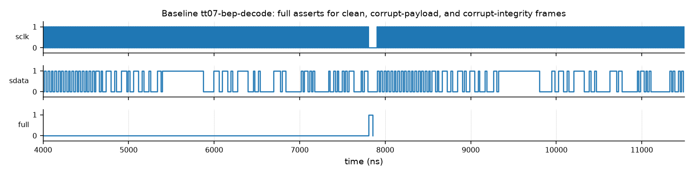
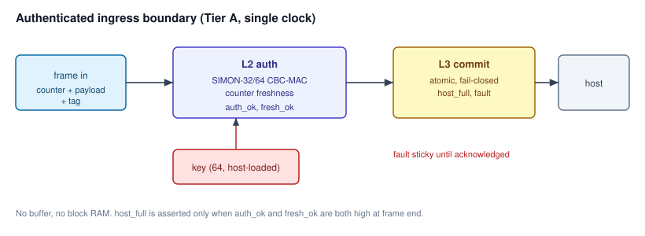
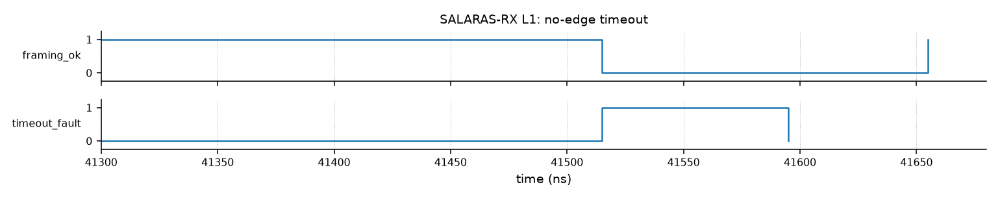

# SALARAS: Authenticated, Replay-Resistant Ingress Boundary for Lightweight Serial Links

Kategori: IC Chip Design & FPGA Implementation

Area Fokus: 04 - Secure Communication (secure framing & interface integrity)

## 1. Ringkasan Ide (Executive Summary)

SALARAS adalah IP gerbang ingress berbasis hardware yang memastikan *host* hanya pernah melihat *frame* yang terautentikasi dan segar. *Frame* yang gagal diperiksa tidak pernah sampai ke *host*.

Masalah yang Diangkat:

Penerima serial dan RF ringan memparsing *bitstream* tak tepercaya langsung ke register dan meneruskan *field* integritas ke *host* tanpa memeriksanya. Pada *baseline* Manchester Tiny Tapeout 07 `tt07-bep-decode`, kami mengukur bahwa *payload* korup dan *field* integritas korup tetap diteruskan dengan `full=1` (CWE-354). Tanpa kunci dan *counter*, penerima seperti ini juga tidak bisa membedakan *frame* asli dari *frame* palsu atau *frame* lama yang diputar ulang.

Solusi yang Ditawarkan:

Gerbang ingress *fail-closed* dengan tiga lapis pertahanan di dalam satu inti:

1. **L1 Pemuat frame:** geser *frame* 128 bit (counter + payload + tag) dan kunci 64 bit secara serial, dengan kunci *write-once* yang terkunci sampai reset (CWE-20).
2. **L2 Autentikasi:** MAC berkunci SIMON-32/64 dalam mode CBC-MAC panjang tetap, ditambah pemeriksaan *counter* monoton (CWE-345, CWE-354, CWE-294).
3. **L3 Commit atomik:** data dan sinyal `host_full` dilepas bersamaan dalam satu siklus, hanya jika autentikasi dan kesegaran lulus; jika gagal, `fault` menyala dan lengket sampai di-*acknowledge* (CWE-1264, CWE-1245).

Chip yang Dirancang:

IP digital murni, satu domain *clock*, tanpa *block RAM* dan DSP. Inti ini tidak bergantung pada *front-end*, sehingga dapat dipasang di belakang *baseline* resmi Area 04 TT07 SerDes, dekoder Manchester/RF, atau UART. Target: ASIC sky130 (Tiny Tapeout) dan FPGA DE10-Nano.

Target Pengguna:

Perancang *secure element* dan perangkat identitas, *integrator* IP yang membutuhkan blok *ingress-hardening*, dan tim *firmware* yang perlu jaminan bahwa *frame* yang dibaca sudah terautentikasi.

Hasil Terukur:

| Metrik | Hasil | Sumber |
| --- | --- | --- |
| *Single-bit flip* pada *frame* | 128/128 ditolak | Simulasi cocotb |
| Forgery, kunci salah, replay, *counter* basi | Semua ditolak | Simulasi cocotb |
| False reject | 0 dari 20 *frame* bersih | Simulasi cocotb |
| Latensi ujung ke ujung | 108 siklus (2,16 µs pada 50 MHz) | Simulasi |
| Properti *fail-closed* | 5 properti lolos (3 inti, 2 lampiran RF) + 6 properti L1 | SymbiYosys |
| *Hardening* sky130 | Tile 2×2, 0,0756 mm², 2354 sel, DRC 0, LVS 0, WNS 0,00, 1,87 mW | OpenLane |

Dampak:

*Frame* yang korup, dipalsukan, atau diputar ulang tidak lagi tampak sah bagi *host*. Pemeriksaan terjadi di *hardware*, sebelum data melewati batas kepercayaan, dengan biaya kurang dari 0,08 mm² dan 1,9 mW.

## 2. Latar Belakang & Rumusan Masalah (Problem Statement)

### 2.1 Latar Belakang

Tautan serial dan RF membawa data antara *transceiver*, terminal, *secure element*, dan *host* pada sistem identitas dan pembayaran. Pada rancangan ringan, *line coding* fisik (Manchester, 8b/10b) sering dianggap memadai. Akibatnya penerima memparsing *bitstream* tak tepercaya dan tidak mengautentikasi *frame* apa pun.

Tiga kelas kegagalan mengikuti:

1. **Integritas tidak divalidasi (CWE-354, CWE-345).** CRC atau ECC tanpa kunci hanya mendeteksi error acak. Penyerang aktif dapat menghitung ulang nilai tersebut untuk *frame* palsu. Pemeriksaan yang tidak diimplementasikan sama sekali tidak memberi jaminan apa pun.
2. **Replay (CWE-294).** *Frame* lama yang sah tetap sah jika tidak ada penanda kesegaran. Serangan *replay* dan *jamming-replay* pada *remote* 433 MHz (contoh terkenal: RollJam, Kamkar 2015) menunjukkan kelas serangan ini praktis pada tautan RF murah.
3. **Commit tidak atomik (CWE-1264), FSM rapuh (CWE-1245), dan input tak tervalidasi (CWE-20).** Data dan sinyal kendali (`full`, *latch enable*) dapat terlepas satu sama lain, sehingga *host* bisa membaca data yang belum selesai diperiksa.

Verifikasi di *software* tidak menutup celah ini, karena *software* berjalan setelah data sudah melewati batas kepercayaan.

### 2.2 Bukti dari Tautan Nyata

Kami memakai `tt07-bep-decode` (dekoder Manchester 433 MHz, Tiny Tapeout 07) sebagai **contoh terukur**, bukan sebagai desain yang cacat untuk tujuan aslinya. Desain tersebut dibuat untuk mendekode protokol termostat dan memang tidak mengklaim keamanan. Justru karena itu ia mewakili pola umum pada penerima ringan.

- *Baseline* menerima *field* integritas 24 bit (`tail_1..3`) dan meneruskannya ke *host* tanpa pemeriksaan.
- Dalam simulasi, *baseline* meng-*latch* *payload* korup dan *field* integritas korup dengan `full=1` (CWE-354, terukur; rincian di Lampiran F).
- *Field* tersebut adalah kode pengoreksi galat yang tidak terdokumentasi (dikonfirmasi penulis *baseline*) dan algoritmanya belum dipecahkan. Karena itu kasus RF kami pakai sebagai **bukti kelas kerentanan**, bukan sebagai jalur integritas yang kami klaim sudah diperbaiki.

<figure class="proto"><figcaption>Gambar 1. Baseline tt07-bep-decode: full naik untuk frame bersih, payload korup, dan field integritas korup.</figcaption></figure>

### 2.3 Gap terhadap Solusi yang Tersedia

Belum ada blok hemat area yang menggabungkan autentikasi, kesegaran, dan *commit* atomik *fail-closed* tepat di batas ingress.

| Pendekatan | Yang ditangani | Yang tidak ditangani |
| --- | --- | --- |
| *Parity* atau CRC | Error acak | Forgery, replay, *framing* |
| 8b/10b penuh | Keseimbangan DC, sinkronisasi | Integritas sama sekali |
| Dekoder standar | Validasi awal *frame* | Isi *frame* |
| Verifikasi *software* | Fleksibel | Berjalan setelah batas kepercayaan dilewati |
| MAC tanpa kesegaran | Forgery | Replay |
| AEAD penuh (mis. Ascon) | Forgery dan kerahasiaan | Kesegaran dan *commit gating* tetap perlu dirancang; area lebih besar |
| **SALARAS** | **Forgery, replay, commit atomik fail-closed** | Kerahasiaan (di luar cakupan, lihat Lampiran G) |

### 2.4 Rumusan Masalah

1. Bagaimana mengautentikasi *frame* yang diterima terhadap forgery dengan biaya area yang sesuai untuk Tiny Tapeout (CWE-345)?
2. Bagaimana menolak *frame* yang diputar ulang dalam satu sesi daya, tanpa memori *non-volatile* (CWE-294)?
3. Bagaimana mengomit data dan kendali secara atomik dan *fail-closed*, sehingga *frame* yang gagal diperiksa tidak pernah terlihat oleh *host* (CWE-1264, CWE-1245)?
4. Bagaimana menjadikannya inti yang dapat dipakai ulang di belakang *front-end* berbeda, terutama *baseline* resmi TT07 SerDes, serta pada FPGA maupun ASIC?

## 3. Proposed Chip Design

SALARAS adalah satu inti digital satu *clock* yang duduk di antara *front-end* tak tepercaya dan *host*: *frame* masuk, diautentikasi, diperiksa kesegarannya, lalu dilepas atomik atau ditolak.

### 3.1 Arsitektur Sistem

<figure class="proto"><figcaption>Gambar 2. Arsitektur SALARAS: batas kepercayaan, tiga lapis, jalur kunci terpisah. Semua yang datang dari tautan dianggap tak tepercaya; kunci masuk dari host lewat jalur terpisah, dan hanya L3 yang boleh melepas data ke host.</figcaption></figure>

<figure class="proto"><figcaption>Gambar: format frame tautan (128 bit) dan rantai CBC-MAC.</figcaption></figure>

Format frame (128 bit + kunci terpisah):

| Field | Lebar | Fungsi |
| --- | --- | --- |
| Counter | 32 bit | Penanda kesegaran, harus lebih besar dari *counter* terakhir yang diterima |
| Payload | 64 bit | Data aplikasi |
| Tag | 32 bit | CBC-MAC atas *counter* + *payload* |
| Kunci | 64 bit | **Tidak** ikut *frame*; dimuat *host* lewat port tepercaya |

Rantai CBC-MAC atas tiga blok 32 bit (B1 = counter, B2-B3 = payload), IV = 0, kunci 64 bit:

**C₁ = E_K(B₁), C₂ = E_K(C₁ ⊕ B₂), tag = C₃ = E_K(C₂ ⊕ B₃)**

*Frame* diterima hanya jika tag hasil hitung sama dengan tag yang diterima **dan** *counter* lebih besar dari *counter* terakhir yang diterima.

Rincian modul:

| Modul | Lapisan | Fungsi |
| --- | --- | --- |
| `l1_serial_loader.v` | L1 | Geser kunci 64 bit dan *frame* 128 bit secara serial; kunci *write-once*, terkunci sampai reset |
| `simon32_64.v` | L2 | Blok *cipher* SIMON-32/64 terserialisasi, satu ronde per siklus |
| `l2_auth.v` | L2 | CBC-MAC atas *counter* + *payload* (tiga blok 32 bit), perbandingan tag, pemeriksaan kesegaran *counter* |
| `l3_commit_gatekeeper.v` | L3 | *Commit* atomik hanya jika autentikasi dan kesegaran lulus; jika gagal, menahan `host_full` dan menaikkan `fault` lengket |
| `salaras_auth_top.v` | L2+L3 | Integrasi L2 dan L3 |
| `project.v` | Wrapper | Pembungkus Tiny Tapeout: instansiasi L1 + L2+L3 |

Antarmuka `salaras_auth_top`:

| Sinyal | Arah | Lebar | Keterangan |
| --- | --- | --- | --- |
| `key` | Masuk (*host*) | 64 | Kunci MAC, dimuat lewat port tepercaya |
| `counter`, `payload`, `tag` | Masuk (tautan) | 32, 64, 32 | *Frame* dari *front-end* |
| `host_data` | Keluar | 96 | *Counter* + *payload* yang sudah lolos |
| `host_full` | Keluar | 1 | Naik hanya jika `auth_ok` dan `fresh_ok` |
| `auth_ok`, `fresh_ok`, `done` | Keluar | 1 | Status per *frame* |
| `fault` | Keluar | 1 | Lengket sampai di-*acknowledge host* |

*Handshake*: `host_full` sebagai penanda data siap; `fault` lengket hingga di-*acknowledge*.

Arsitektur Pemrosesan dan Memori:

- Aliran *streaming* satu arah; CBC-MAC berjalan sambil blok masuk.
- Tanpa *block RAM* dan tanpa *buffer frame*. State hanya register: state *cipher*, *counter* terakhir, flag status.

Konsumsi Daya:

- Logika digital *clock* tunggal, tanpa DSP, PLL internal, atau memori besar.
- MAC aktif hanya saat *frame* datang, sehingga aktivitas *switching* minimal saat *idle*. Hasil OpenLane: daya tipikal 1,87 mW.

### 3.2 Security Design (Threat Model)

Keamanan adalah titik awal desain ini, bukan fitur tambahan: setiap modul ada karena satu ancaman di tabel di bawah.

**Aset yang dilindungi:** integritas dan keaslian *frame* yang sampai ke *host*, kesegaran *frame*, dan kerahasiaan kunci MAC.

**Batas kepercayaan:**
- *Tidak tepercaya:* semua yang datang dari tautan (*front-end* SerDes, Manchester/RF, UART), termasuk *counter*, *payload*, dan tag.
- *Tepercaya:* *host* dan port pemuatan kunci. Kunci tidak pernah melewati tautan.

**Kemampuan penyerang:** dapat menyadap, menyisipkan, mengubah, menghapus, dan memutar ulang *frame* pada tautan; dapat membuat error bit acak. **Tidak** memiliki kunci, tidak dapat membaca register internal, dan tidak melakukan serangan kanal samping atau *glitch* fisik (di luar cakupan, Lampiran G).

**Ancaman, mitigasi, dan bukti:**

| Ancaman | CWE | Mitigasi di hardware | Bukti |
| --- | --- | --- | --- |
| *Frame* palsu | CWE-345 | CBC-MAC SIMON-32/64, tag 32 bit | Forgery ditolak (simulasi) |
| Integritas tidak dicek | CWE-354 | Tag selalu dihitung ulang dan dibandingkan sebelum *commit* | 128/128 *bit flip* ditolak |
| Replay *frame* lama | CWE-294 | *Counter* harus naik ketat | Replay dan *counter* basi ditolak |
| Data dan kendali terlepas | CWE-1264 | *Commit* satu siklus: `host_data` dan `host_full` dilepas bersamaan, dari salinan *frame* yang di-*latch* saat MAC dimulai | Properti formal |
| FSM macet atau state ilegal | CWE-1245 | FSM terenumerasi penuh, *timeout*, `fault` lengket | Properti formal, uji *timeout* |
| *Framing* tidak sah | CWE-20 | *Frame* dengan panjang atau struktur salah ditolak di pemuat | Uji *timeout* (Lampiran RF) |

**Keputusan desain kriptografi:**

- **Kenapa SIMON-32/64.** *Cipher* ini dirancang untuk *hardware* sangat kecil dan dapat diserialisasi satu ronde per siklus, sehingga muat di tile Tiny Tapeout 2×2. Kami sadar SIMON/SPECK ditolak sebagai standar ISO pada 2018 dan bahwa standar NIST untuk kriptografi ringan saat ini adalah Ascon. Karena itu *cipher* dibungkus antarmuka blok yang modular: dapat diganti ke SIMON-64/128 atau Ascon tanpa mengubah L2 dan L3, dengan biaya area lebih besar.
- **CBC-MAC hanya untuk panjang tetap.** CBC-MAC aman hanya jika semua pesan berpanjang sama. Format *frame* dikunci pada tiga blok; jika suatu saat panjang *frame* variabel, mode diganti ke CMAC.
- **Batas *birthday* blok 32 bit.** Dengan blok 32 bit, keamanan CBC-MAC turun setelah sekitar 2¹⁶ blok di bawah kunci yang sama, kira-kira 2×10⁴ *frame*. Kebijakan integrasi: kunci wajib dirotasi jauh di bawah batas ini (rekomendasi: setiap 2¹² *frame*).
- **Peluang forgery per percobaan** sekitar 2⁻³² karena tag 32 bit.
- **Waktu keputusan tetap.** Keputusan terima/tolak keluar pada siklus yang sama untuk semua *frame*. L2 selalu memproses ketiga blok tanpa jalan keluar lebih awal.
- **Perilaku setelah reset.** *Counter* terakhir kembali ke 0 setelah reset. Rekomendasi integrasi: *host* memuat kunci sesi baru setiap *boot*. Kunci juga *write-once*: dimuat sekali setelah reset lewat mode kunci terpisah, lalu terkunci sampai reset.

### 3.3 Estimasi Penggunaan Resource

Estimasi FPGA (Yosys, sebelum sintesis Quartus):

| Komponen | Estimasi | Kapasitas DE10-Nano (5CSEBA6U23I7) |
| --- | --- | --- |
| Logika | sekitar 360 LUT-setara | 41.910 ALM |
| Register | sekitar 500 FF | 166.036 |
| *Block RAM* (M10K) | 0 | 5.570 Kbit |
| DSP | 0 | 112 |

Satuan LUT-setara dari Yosys tidak sama dengan ALM Quartus; angka final menunggu laporan Fitter. Jumlah register lebih besar dari LUT karena sebagian besar state adalah register *frame*, kunci, dan state *cipher*.

Target ASIC: Tiny Tapeout sky130 130nm via OpenLane.

*Hardening* sky130 (hasil nyata): tile 2×2, die 0,0756 mm², 2354 sel, DRC 0, LVS 0, WNS 0,00, daya tipikal 1,87 mW.

Lampiran RF memiliki hasil nyata terpisah: tile 1×2, die 0,0363 mm², WNS 0,00, daya tipikal 1,21 mW. Angka ini **bukan** angka inti SALARAS (lihat Lampiran F).

Perangkat Lunak dan Tools:

- Intel Quartus Prime (sintesis, *fit*, *timing*, SignalTap) untuk DE10-Nano.
- OpenLane/OpenROAD dan Yosys untuk jalur ASIC sky130.
- Verilator dan Icarus Verilog untuk simulasi dan lint.
- cocotb dan pytest untuk *testbench* otomatis.
- SymbiYosys (pembuktian formal, mesin smtbmc z3).

Laju: 108 siklus per *frame* pada 50 MHz = 2,16 µs, setara sekitar 29 Mbit/s *payload*. Angka ini jauh di atas laju tautan RF 433 MHz, sehingga autentikasi tidak menjadi *bottleneck*.

### 3.4 Rencana Pengujian

Simulasi RTL (S1, terukur):

- *Testbench* cocotb menguji L1, L2, dan *commit* dengan matriks keberhasilan: *frame* bersih diterima, forgery, kunci salah, replay, dan *counter* basi ditolak, serta 128 dari 128 *single-bit flip* ditolak.
- Latensi diukur per tahap: 33 siklus per blok SIMON, 107 siklus untuk MAC dan kesegaran, 108 siklus ujung ke ujung.

<figure class="proto"><figcaption>Gambar 3. Inti SALARAS: frame pertama lolos (auth_ok, fresh_ok, host_full naik); frame kedua ditolak (host_full tetap rendah, fault naik).</figcaption></figure>

<figure class="proto"><figcaption>Gambar 4. Lampiran RF: tanpa transisi selama 4096 siklus, timeout_fault naik dan framing_ok turun, sehingga frame ditolak.</figcaption></figure>

Pembuktian formal (SymbiYosys):

| Job SymbiYosys | Properti | Lingkup |
| --- | --- | --- |
| `auth_top` | `host_full` hanya tinggi jika *frame* terakhir yang selesai lolos `auth_ok` dan `fresh_ok` | Inti |
| `l3_commit` | `host_full` hanya tinggi jika keputusan *commit* terakhir menerima *frame* | Inti |
| `simon32_64` | `done` hanya naik setelah tepat 32 ronde | Inti |
| `l1_link` | 6 properti: `key_load`/`start` saling eksklusif, `start` hanya setelah kunci terkunci, `key_load` hanya sebelum kunci terkunci, `key_locked` lengket, keduanya *single-cycle pulse* | L1 |
| `l1_framing` | `framing_ok` tidak pernah tinggi bersamaan dengan `timing_fault` atau `timeout_fault` | Lampiran RF |
| `l2_integrity` | Register CRC selalu mulai dari nilai awal saat *frame* dimulai | Lampiran RF |
| `auth_data_integrity` | Data yang dikomit sama dengan *frame* yang diautentikasi (non-pemblokir, depth=130) | Inti |

Uji Hardware Board FPGA DE10-Nano (S2, rencana):

- *Prosedur sintesis*: proyek Quartus dengan pembungkus *board*, SDC, dan *pin assignment*.
- *Implementasi bitstream* (.sof/.rbf) dan pengujian *on-board real-time*.
- Verifikasi sinyal internal dengan SignalTap pada `auth_ok`, `fresh_ok`, `done`, `host_full`, dan `fault`.
- Uji *on-board*: *frame* bersih diterima, *frame* korup ditolak, replay tidak dikomit, *frame* yang mencoba memuat kunci baru diabaikan.
- Fasilitas FPGA/sandbox dari penyelenggara dipakai pada *bootcamp* untuk menjalankan tahap ini.

Metrik Keberhasilan Target:

| Metrik | Target | Bukti |
| --- | --- | --- |
| Deteksi error satu bit | 128/128 teramati; peluang lolos teoretis sekitar 2⁻³² | Simulasi |
| False reject | 0 persen | Simulasi (20 *frame* bersih) |
| Forgery dan replay | Ditolak | Simulasi, lalu *on-board* |
| Latensi ujung ke ujung | 108 siklus | Simulasi, lalu SignalTap |
| *Fail-closed* | 5 properti lolos (3 inti, 2 lampiran RF) + 6 L1 | SymbiYosys |
| Fmax FPGA | Minimal 50 MHz (CLOCK_50) | Quartus Timing Analyzer |

## 4. Referensi

1. PERURI. "Buku Panduan Peserta PERURI Chip Hackathon 2026." https://summit.peruri.co.id/docs/Buku-Panduan-PERURI-Chip-Hackathon.pdf
2. PERURI. "Peruri Chip Design Datasheet" dan *baseline* rujukan Area 04 (TT07 SerDes, CDC FIFO).
3. Kohnen, Z. "Decoding Manchester coded transmissions in a fully digital ASIC." Skripsi, 2024.
4. Kohnen, Z. dan Alvarado, A. "Manchester decoder of a home thermostat's wireless protocol." FSiC, 2025.
5. Beaulieu, R. et al. "The SIMON and SPECK Families of Lightweight Block Ciphers." IACR ePrint 2013/404.
6. Bellare, M., Kilian, J., dan Rogaway, P. "The Security of the Cipher Block Chaining Message Authentication Code." Journal of Computer and System Sciences 61(3), 2000.
7. NIST. SP 800-38B, "Recommendation for Block Cipher Modes of Operation: The CMAC Mode for Authentication." https://csrc.nist.gov/
8. NIST. SP 800-232, "Ascon-Based Lightweight Cryptography Standards for Constrained Devices." https://csrc.nist.gov/
9. Kamkar, S. "Drive It Like You Hacked It" (RollJam), DEF CON 23, 2015.
10. Tiny Tapeout. "Tiny Tapeout - Make Your Own Chip." https://tinytapeout.com/, 2024.
11. MITRE. "Common Weakness Enumeration (CWE): CWE-20, CWE-294, CWE-345, CWE-354, CWE-1245, CWE-1264." https://cwe.mitre.org/, 2024.
12. Terasic. "DE10-Nano - Cyclone V FPGA User Manual."
13. Intel. "Cyclone V Device Overview."

## 5. Lampiran

### Lampiran A. Identitas Tim dan Pembagian Peran

Tim **dinotice**, Universitas Telkom.

| Nama | NIM / NIP | Institusi | Program Studi | Posisi | Keahlian | Peran |
| --- | --- | --- | --- | --- | --- | --- |
| Ibrahim Fauzi Rahman | 1301213xxx | Universitas Telkom, Fakultas Teknik Elektro | S1 Teknik Elektro | Ketua | RTL / Verilog | Perancang RTL, integrasi, sintesis |
| Idris Syaifulloh | 1301210541 | Universitas Telkom, Fakultas Teknik Elektro | S1 Teknik Elektro | Anggota | Verifikasi / Python | cocotb, *fault injection*, metrik |
| Dr. Setia Juli Irzal Ismail, S.T., M.T. | NIP 197207xx | Universitas Telkom, Fakultas Teknik Elektro | — | Dosen Pembimbing | Arsitektur / Metodologi | Pembimbing, validasi klaim |

### Lampiran B. Luaran dan Demo

- Kode RTL Verilog, *testbench* cocotb, dan properti formal SymbiYosys.
- Hasil *hardening* sky130 (GDS, laporan DRC/LVS/timing/daya).
- Bitstream FPGA (.sof/.rbf) dan demo *on-board* (*bootcamp*).
- *Repository* sumber dan laporan teknis singkat.

### Lampiran C. Rencana Bootcamp (18-20 Oktober 2026)

| Hari | Fokus | Deliverable |
| --- | --- | --- |
| 1 (18 Okt) | Integrasi inti dengan *baseline* TT07 SerDes; uji korupsi multi-bit acak dan replay setelah reset | RTL terintegrasi lolos simulasi |
| 2 (19 Okt) | Sintesis Quartus, SignalTap, uji forgery dan replay *on-board* | Bitstream, laporan resource dan timing |
| 3 (20 Okt) | Pengukuran akhir, poles *hardening*, demo, presentasi seleksi Top 3 | Demo dan materi presentasi |

### Lampiran D. Anggaran Latensi (terukur)

| Tahap | Siklus |
| --- | --- |
| Satu blok SIMON-32/64 (32 ronde + 1) | 33 |
| Tiga blok CBC-MAC | 99 |
| *Overhead* FSM: 2 siklus *handshake start/done* per blok (×3), 1 siklus *latch* input, 1 siklus keputusan | 8 |
| MAC dan kesegaran | 107 |
| Commit | 1 |
| **Ujung ke ujung** | **108** |

### Lampiran E. Perbandingan Integritas (terukur)

| Properti | CRC tanpa kunci | MAC berkunci | MAC + counter (SALARAS) |
| --- | --- | --- | --- |
| Latensi | 73 siklus (CRC serial 72 bit) | 107 siklus | 108 siklus |
| Deteksi error acak | Ya | Ya | Ya |
| Tahan forgery | Tidak | Ya | Ya |
| Tahan replay | Tidak | Tidak | Ya |

Tambahan satu siklus untuk kesegaran dan *commit* memberi ketahanan *replay*; tambahan 34 siklus dibanding CRC memberi ketahanan forgery.

### Lampiran F. Bukti Masalah (RF)

*Baseline* `tt07-bep-decode` menerima `payload` dan *field* integritas yang korup dengan `full=1` (CWE-354, terukur). Rincian pada `sim/RESULTS.md`.

Hasil *hardening* sky130 desain lampiran RF (front-end *baseline* ditambah L1 *framing*, L2 integritas CRC terparametrisasi, dan *gate* L3 yang sama dengan inti): tile 1×2, die 0,0363 mm², WNS 0,00, daya tipikal 1,21 mW. Angka ini **bukan** angka inti SALARAS (lihat 3.3).

### Lampiran G. Batasan

| Batasan | Dampak | Mitigasi atau rencana |
| --- | --- | --- |
| Tidak ada kerahasiaan *payload* | *Payload* dapat dibaca penyadap | Di luar cakupan; dapat ditambah dengan AEAD (mis. Ascon) |
| Tag 32 bit | Peluang forgery sekitar 2⁻³² per percobaan | Cukup untuk tautan ringan; tag lebih panjang dengan *cipher* 64 bit |
| Blok 32 bit (*batas birthday*) | Keamanan turun setelah sekitar 2¹⁶ blok per kunci | Rotasi kunci wajib, rekomendasi setiap 2¹² *frame* |
| CBC-MAC hanya panjang tetap | Tidak aman untuk *frame* berpanjang variabel | Format dikunci tiga blok; ganti ke CMAC jika variabel |
| *Counter* kembali ke 0 setelah reset | *Frame* lama dapat diterima lagi setelah *power cycle* | Kunci sesi baru setiap *boot* |
| Provisi kunci | Inti tidak mengatur dari mana kunci berasal | Tanggung jawab *host* atau *secure element* |
| Kanal samping dan *glitch* fisik | Tidak dianalisis | Properti formal hanya membuktikan logika, bukan ketahanan fisik |
| *Front-end* dan CDC | Inti saat ini satu domain *clock* | Integrasi TT07 SerDes saat *bootcamp* |
| Angka FPGA | Masih estimasi Yosys | Laporan Fitter Quartus saat *bootcamp* |

### Lampiran H. Uji Hardware FPGA DE10-Nano

- **Papan:** Terasic DE10-Nano, Cyclone V SoC (5CSEBA6U23I7), Quartus Prime.
- **Clock:** `CLOCK_50` (50 MHz) langsung, satu domain *clock*.
- **Prosedur:** sintesis (`quartus_sh --flow compile`), unggah *bitstream* (.sof/.rbf), uji *on-board real-time*.
- **Pemuatan kunci:** sekali setelah reset, dengan `SW[0]` tinggi, kunci 64 bit digeser MSB-*first* lewat GPIO. Kunci lalu terkunci sampai reset (`LEDR[5]` naik); *frame* diabaikan sampai kunci dimuat. Pada Tiny Tapeout, mode kunci memakai pin `ui_in[3]`.
- **Pemuatan *frame*:** dengan `SW[0]` rendah, *frame* 128 bit (counter 32, payload 64, tag 32) digeser lewat GPIO; inti lalu menjalankan MAC.
- **SignalTap:** `auth_ok`, `fresh_ok`, `done`, `host_full`, `fault`.
- **Skenario uji:** *frame* bersih diterima (`host_full` naik); *frame* korup ditolak (`host_full` tetap rendah, `fault` naik); replay tidak dikomit; *frame* yang mencoba memuat kunci baru diabaikan.
- **Laporan:** Fitter (ALM, FF, M10K, DSP), Timing Analyzer (Fmax, WNS), PowerPlay.
- **Fasilitas:** FPGA/sandbox penyelenggara saat *bootcamp*.
